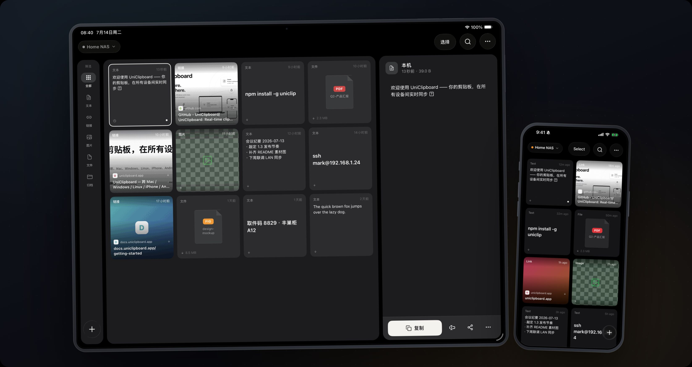

# UniClip

[简体中文](./README.md) · **English**

An open-source cross-device clipboard sync tool — sync text, images, and files across multiple devices and operating systems. End-to-end encrypted, no sign-up, no cloud.

Website: <https://uniclipboard.app>

Covers **Android**, **iOS**, and desktop.

## Install

| Platform | How to get it |
| -------- | ------------- |
| Android  | Download the APK from [GitHub Releases](https://github.com/UniClipboard/UniClip/releases/latest) (`arm64-v8a` / `armeabi-v7a` / `x86_64` / `universal`); China mirror on [Gitee](https://gitee.com/uni-clipboard/uc-android/releases) |
| iOS      | [TestFlight public beta](https://testflight.apple.com/join/nyNQ8dQe) (install TestFlight first) |
| Desktop  | See [UniClipboard/UniClipboard](https://github.com/UniClipboard/UniClipboard) |

## Features

### Clipboard sync

- Cross-device sync for text, images, and single files
- Multiple trigger methods:
  - Notification-bar quick actions / foreground service to stay alive
  - Desktop pin shortcut, Quick Settings Tile
  - System share sheet (Share Intent), Android text-selection menu (Process Text)
  - iOS share extension and custom keyboard extension
  - Automatic background sync
- Copy-to-sync: on Android, granting `READ_LOGS` enables event-driven monitoring instead of 1 Hz polling (falls back to polling when the permission is absent)
- Automatic forwarding of SMS verification codes

### Easy onboarding

- QR pairing: scan a QR code with the camera to quickly add a server
- First-run onboarding flow
- Deep links: the `connect` deep link pre-fills the "Add Server" form directly
- Full internationalization (Simplified Chinese / English)

## Screenshots

<p align="center">
  
</p>

## Architecture overview

- **Sync core**: the Rust `uc-mobile` crate (UniFFI) is compiled to a static/dynamic library and exposed to the TS layer through the local Expo module `modules/uc-core`, so Android and iOS share the same sync logic. See [docs/RUST_CORE_INTEGRATION.md](./docs/RUST_CORE_INTEGRATION.md).
- **Real-time push**: SSE (Server-Sent Events) provided by the Rust core drives instant downstream updates — while online the periodic tick becomes a fallback, and on disconnect it falls back to 1 Hz polling.
- **Local storage**: history is persisted to SQLite; on iOS a shared App Group shares data between the main app and its extensions.
- **Platform-split UI**: every component that differs across platforms is split via Metro platform files —
  - iOS: Liquid Glass / SwiftUI (`@expo/ui`, `expo-glass-effect`, `lucide-react-native`)
  - Android: Material Design 3 / Jetpack Compose (`@expo/ui/jetpack-compose`, Ionicons)
- **In-house native modules** (`modules/`): `uc-core`, `foreground-service`, `native-timer`, `clipboard-overlay`, `app-group-store`, `android-util`, `qr-scanner`, `shortcut`, `sms-forwarder`.

## Development

> Expo changes significantly between versions. Read the matching version docs before writing code: <https://docs.expo.dev/versions/v56.0.0/>

### Install dependencies

```bash
npm install
```

### Generate native projects

```bash
npm run prebuild
```

### Run in debug

```bash
# Android
npm run android

# iOS
npm run ios
```

### Build the APK

```bash
npm run build:apk
```

### Other commands

```bash
# Unit tests
npm test

# Type check
npm run type-check

# Lint / auto-fix
npm run lint
npm run lint:fix

# Format docs (JSON / Markdown)
npm run format-docs

# Build the Expo native plugin
npm run plugin:build
```

## Release & versioning

For the release process and versioning strategy, see [docs/RELEASE.md](./docs/RELEASE.md). For building iOS locally and uploading to TestFlight, see [docs/ios-release-ci.md](./docs/ios-release-ci.md).

## Acknowledgements

The mobile side of UniClip was originally forked from [Jeric-X/syncclipboard-mobile](https://github.com/Jeric-X/syncclipboard-mobile) (MIT, by JericX). Many thanks.

## License

This project includes the following copyright notices:

- Copyright (c) 2026 JericX (original author of the upstream SyncClipboard)
- Copyright (c) 2026 mkdir700 (UniClip)

See [LICENSE](./LICENSE) for details.
