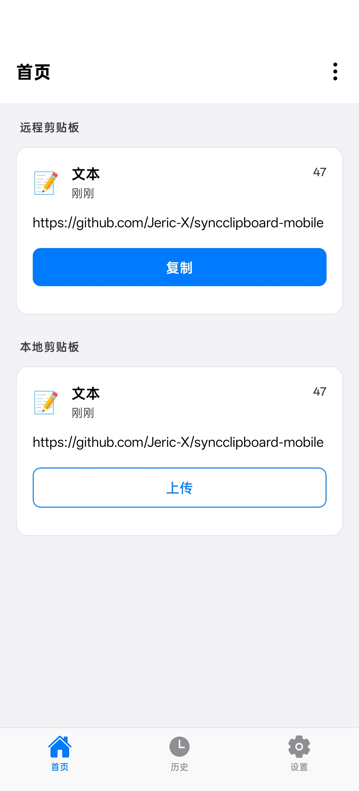
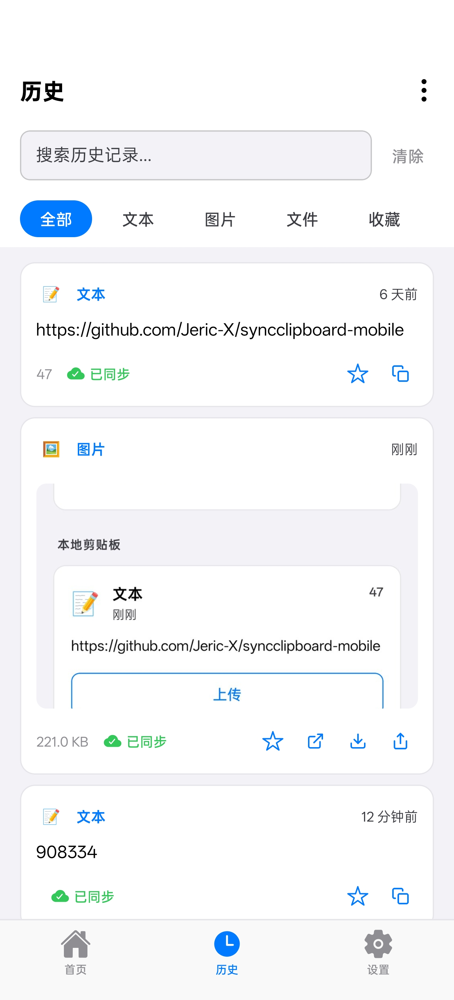
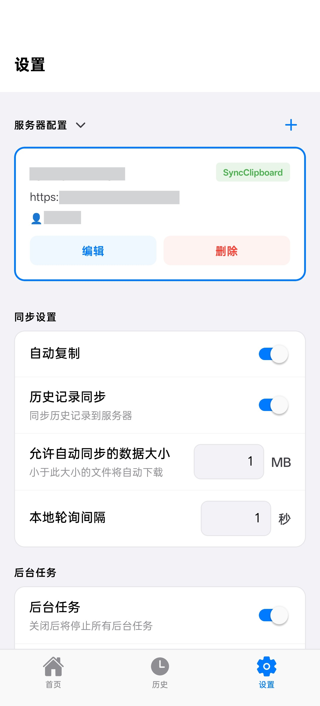

# UniClip

开源的跨设备剪贴板同步工具 —— 在多台设备、多种操作系统之间同步文本、图片和文件。端到端加密，无需注册，无需云端。

官网：<https://uniclipboard.app>

支持 **Android**（已出货）与 **iOS**（公测中）。

## 功能特性

### 剪贴板同步

- 文本、图片、单文件的跨设备同步
- 多种触发方式：
  - 通知栏快捷操作 / 前台服务保活
  - 桌面 pin 快捷方式、快速设置磁贴（Quick Settings Tile）
  - 系统分享菜单（Share Intent）、Android 划词菜单（Process Text）
  - iOS 分享扩展与自定义键盘扩展
  - 后台自动同步
- 复制即同步：Android 授予 `READ_LOGS` 后启用事件驱动监听，替代 1Hz 轮询空转（无权限时自动回落轮询）
- 短信验证码自动转发上传

### 便捷接入

- 扫码配对：摄像头扫描二维码快速添加服务器
- 首次运行引导（Onboarding）
- 深度链接：`connect` 深链直接预填「添加服务器」表单
- 完整国际化（简体中文 / English）

## 截图

<p align="center">
  
  
  
</p>

## 架构概览

- **同步核心**：Rust `uc-mobile`（UniFFI）编译为静态/动态库，通过本地 Expo 模块 `modules/uc-core` 暴露给 TS 层，Android / iOS 共用同一份同步逻辑。详见 [docs/RUST_CORE_INTEGRATION.md](./docs/RUST_CORE_INTEGRATION.md)。
- **实时推送**：由 Rust 核心提供的 SSE（Server-Sent Events）驱动即时下行，在线时把周期 tick 降为兜底、断开时回落 1Hz 轮询。
- **本地存储**：历史记录持久化到 SQLite；iOS 通过共享 App Group 在主 App 与扩展之间共享数据。
- **平台分离 UI**：所有跨平台差异的组件按 Metro 平台文件拆分——
  - iOS：Liquid Glass / SwiftUI（`@expo/ui`、`expo-glass-effect`、`lucide-react-native`）
  - Android：Material Design 3 / Jetpack Compose（`@expo/ui/jetpack-compose`、Ionicons）
- **自研原生模块**（`modules/`）：`uc-core`、`foreground-service`、`native-timer`、`clipboard-overlay`、`app-group-store`、`native-util`、`qr-scanner`、`shortcut`、`sms-forwarder`。

## 开发

> Expo 版本变动较大，写代码前请先阅读对应版本文档：<https://docs.expo.dev/versions/v56.0.0/>

### 安装依赖

```bash
npm install
```

### 生成原生项目

```bash
npm run prebuild
```

### 调试运行

```bash
# Android
npm run android

# iOS
npm run ios
```

### 构建 APK

```bash
npm run build:apk
```

### 其他命令

```bash
# 单元测试
npm test

# 类型检查
npm run type-check

# 代码检查 / 自动修复
npm run lint
npm run lint:fix

# 格式化文档（JSON / Markdown）
npm run format-docs

# 构建 Expo 原生插件
npm run plugin:build
```

## 发布与版本号

发版流程、版本号策略见 [docs/RELEASE.md](./docs/RELEASE.md)。iOS 本地构建并上传 TestFlight 的流程见 [docs/ios-release-ci.md](./docs/ios-release-ci.md)。

## 致谢

UniClip 早期基于以下开源项目起步，特此致谢：

- [Jeric-X/SyncClipboard](https://github.com/Jeric-X/SyncClipboard) — 原始 SyncClipboard 协议与桌面端实现（MIT）
- [Jeric-X/syncclipboard-mobile](https://github.com/Jeric-X/syncclipboard-mobile) — 移动端原始实现（MIT，作者 JericX）

## 许可协议

本项目包含以下版权声明：

- Copyright (c) 2026 JericX（上游 SyncClipboard 原作者）
- Copyright (c) 2026 mkdir700（UniClip）

详见 [LICENSE](./LICENSE)。
