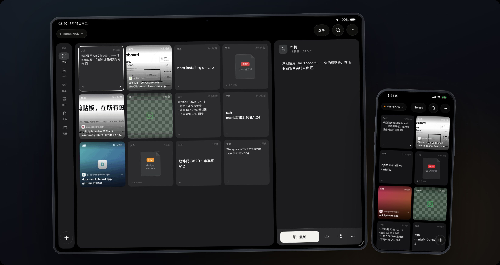

# UniClip

**简体中文** · [English](./README.en.md)

开源的跨设备剪贴板同步工具 —— 在多台设备、多种操作系统之间同步文本、图片和文件。端到端加密，无需注册，无需云端。

官网：<https://uniclipboard.app>

覆盖 **Android**、**iOS** 与桌面端。

## 安装

| 平台    | 获取方式                                                                                           |
| ------- | -------------------------------------------------------------------------------------------------- |
| Android | [GitHub Releases](https://github.com/UniClipboard/UniClip/releases/latest) 下载 APK（`arm64-v8a`） |
| iOS     | [TestFlight 公测](https://testflight.apple.com/join/nyNQ8dQe)（需先安装 TestFlight）               |
| 桌面端  | 见 [UniClipboard/UniClipboard](https://github.com/UniClipboard/UniClipboard)                       |

## 功能特性

### 剪贴板同步

- 文本、图片、单文件的跨设备同步
- 多种触发方式：
  - 通知栏快捷操作 / 前台服务保活
  - 桌面 pin 快捷方式、快速设置磁贴（Quick Settings Tile）
  - 系统分享菜单（Share Intent）、Android 划词菜单（Process Text）
  - iOS 分享扩展与自定义键盘扩展
  - 后台自动同步
- 复制即同步：Android 授予 `READ_LOGS` 后启用事件驱动监听，替代 1Hz 轮询空转（无权限时自动回落轮询）

### 便捷接入

- 通过邀请码创建或加入加密空间
- 首次运行可选择创建空间、加入空间或稍后设置
- 升级用户没有空间时直接进入「加入空间」流程
- 完整国际化（简体中文 / English / Português / Русский）

## 截图

<p align="center">
  
</p>

## 架构概览

- **同步核心**：`uc-engine` 负责空间、设备身份、加密与跨设备传输，Android 和 iOS 共用同一套行为。
- **连接方式**：设备通过邀请码加入同一个空间，不依赖自建服务器配置。
- **本地存储**：历史记录持久化到 SQLite；iOS 通过共享 App Group 在主 App 与扩展之间共享数据。
- **平台分离 UI**：所有跨平台差异的组件按 Metro 平台文件拆分——
  - iOS：Liquid Glass / SwiftUI（`@expo/ui`、`expo-glass-effect`、`lucide-react-native`）
  - Android：Material Design 3 / Jetpack Compose（`@expo/ui/jetpack-compose`、Ionicons）
- **自研原生模块**（`modules/`）：`uc-engine`、`foreground-service`、`native-timer`、`clipboard-overlay`、`app-group-store`、`android-util`、`document-exporter`、`shizuku-clipboard`、`shortcut`。

## 开发

> Expo 版本变动较大，写代码前请先阅读对应版本文档：<https://docs.expo.dev/versions/v56.0.0/>

### 安装依赖

```bash
npm install
```

### 生成原生项目

```bash
npm run prebuild
```

### 调试运行

```bash
# Android
npm run android

# iOS
npm run ios
```

### 本地 Engine 编译文件

开发版安装命令使用 `modules/uc-engine/core-source.json` 固定的 Engine 版本，不自动切换到远端 `main`，避免安装时替换掉应用所需的接口。iOS 开发版在安装前明确准备 Debug 版 React Native 库，并从源码构建 Expo 模块，避免真机调试时混用不兼容的预编译组件。

[共用构建步骤的复用验证记录](docs/tests/engine-build-cache-reuse.md)。

iOS 和 Android 的共用本机库统一保留最小调试信息，并在 Engine 构建子进程中使用同一套 Xcode 工具；显式设置会传给两端，外层应用环境保持原样。固定依赖缓存目录重复使用，不会在共享缓存中重复建立同名链接。

发布版本继续使用带校验信息的 Engine 成品。需要从源码构建时，准备脚本共用 Engine 实际的 Cargo 输出目录，不再为每个提交保留一套编译文件。可通过 `UC_ENGINE_LOCAL_TARGET_DIR` 显式指定持久输出目录。

本机若安装 `uni-build-storage`，每个工作目录独立使用外盘编译目录，共用编译缓存；临时打包文件用完即删，仅写入同一手机模块时互斥，其他项目和工作目录可以同时编译。外盘未挂载时停止。其他开发机与 CI 不依赖该本机工具。

### 构建 APK

```bash
npm run build:apk
```

### 其他命令

```bash
# 单元测试
npm test

# 类型检查
npm run type-check

# 代码检查 / 自动修复
npm run lint
npm run lint:fix

# 构建 Expo 原生插件
npm run plugin:build
```

## 发布与版本号

发版流程、版本号策略见 [docs/RELEASE.md](./docs/RELEASE.md)。iOS 本地构建并上传 TestFlight 的流程见 [docs/ios-release-ci.md](./docs/ios-release-ci.md)。

## 致谢

UniClip 的移动端早期 fork 自 [Jeric-X/syncclipboard-mobile](https://github.com/Jeric-X/syncclipboard-mobile)（MIT，作者 JericX），特此致谢。

## 许可协议

本项目包含以下版权声明：

- Copyright (c) 2026 JericX（上游 SyncClipboard 原作者）
- Copyright (c) 2026 mkdir700（UniClip）

详见 [LICENSE](./LICENSE)。

## 自动连接验收

[宿主接入与测试记录](docs/tests/automatic-peer-connections.md)说明前台、网络变化及共享 Engine 自动重连的接入与验证边界。
