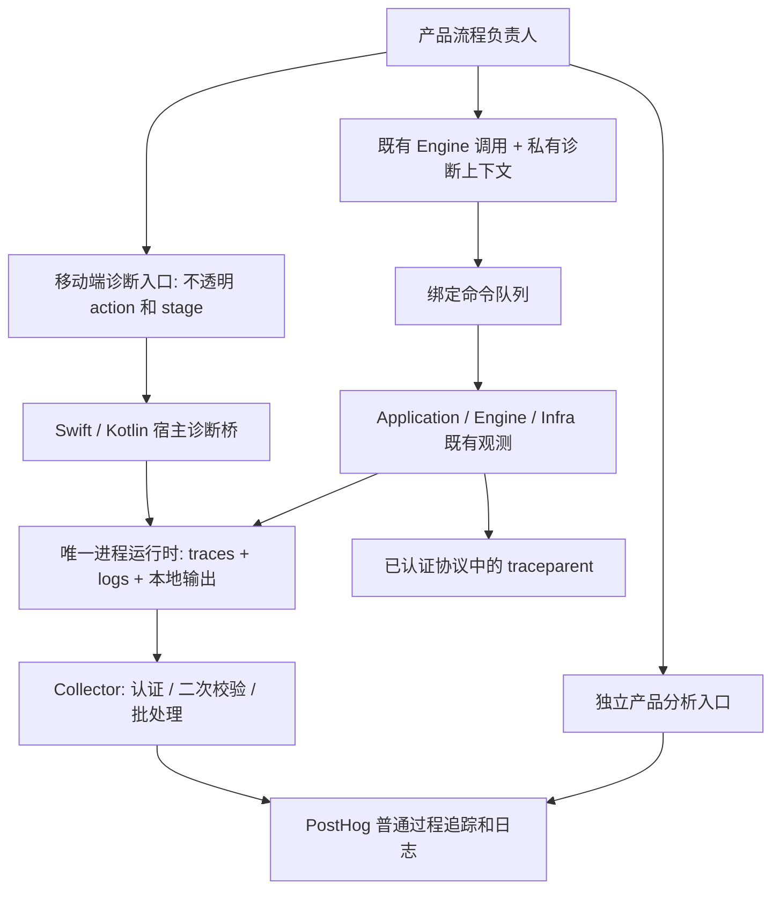

# 规格 004：移动端产品与 Engine 的统一过程追踪和诊断日志

## 文档状态

- 状态：研究完成，实施规格；本文描述目标合同，不代表功能已经实现或正式验收通过。
- 研究日期：2026-09-08。
- 关联任务：[UniClip #22](https://github.com/UniClipboard/UniClip/issues/22)。
- 移动端研究基线：`bddeb535be676ccdca4ea8d70947ba33ddf61091`，包含当前工作区已有的第一阶段日志、安装流程和其他未提交修改。
- Engine 研究基线：`v1.1.0-rc.14`，`168a3ebd7c2701f2e9f8a0ebe0c4a0af4aa14543`；相邻 Engine checkout 与移动端锁定提交一致。
- 当前云端配置目标：PostHog US，项目 `416399`；本文不包含任何真实 token。
- 本文替代第一阶段“固定字符串日志上传”作为最终诊断方案的定位；不抹去其实现和验证历史。
- 本文不修改配对协议、同步策略、历史权威、系统剪贴板策略或成员关系的业务含义。

文中 **必须** 是验收条件，**不得** 是架构或行为禁令，**建议** 是可经证据调整的实现选择。
所有写为“拟新增”的名称均不是现有 API。实施时可调整语言风格，但不能削弱语义。
建议参数不是测量结果；必须在真机验证后记录最终值。未通过的发布门禁不能用“文档已完成”代替。

## 阅读路径

- 第 1–4 节：问题、现状、范围和架构决定。
- 第 5–9 节：生命周期、许可、关联、接口和记录合同。
- 第 10–14 节：配对、同步、平台差异、日志质量和隐私。
- 第 15–18 节：上传、采样、PostHog 展示和部署配置。
- 第 19–22 节：迁移、交付顺序、验收矩阵和发布门禁。
- 第 23–25 节：源码索引、官方资料和本次研究验证。

## 1. 问题与完成目标

### 1.1 当前问题

现有产品日志能说明“刷新过设备”“恢复过连接”“某个调用失败”，但不能可靠回答：

1. 这条日志属于哪一次用户操作？
2. 操作有没有进入 Engine，实际执行到了哪里？
3. 时间花在产品准备、排队、连接、对端处理，还是本机保存？
4. “成功”是提交成功、对方确认保存，还是对方已经能粘贴？
5. 多个并发操作、重复发送、断线恢复是否混在一起？
6. 日志没有出现，是没有执行、没有许可、被过滤、被丢弃，还是上传失败？

只增加消息数量、把每个函数都变成 span、上传本地全部日志，均不解决上述问题。

### 1.2 核心交付

**OBS-G01**：通过真实配对和同步操作，在 PostHog 中看到产品准备、Engine 执行、已认证的对端处理和产品结果处理之间的因果关系。

**OBS-G02**：每个已完成的关键步骤具有确定的结果和耗时；对应完成日志能定位回该步骤。失败原因来自真实返回或已有稳定分类，不从用户提示文字猜测。

**OBS-G03**：只有一端有记录时，明确表达可观察范围。不能把对端记录缺失解释为对端未执行、未收到或未保存。

**OBS-G04**：上传不可用、许可关闭、队列溢出、记录格式错误均不改变配对、同步、历史保存和系统剪贴板的结果。

**OBS-G05**：验证“有用”而非仅验证“收到”：不读源码的人应能从一次记录回答触发原因、目的、已完成部分、失败或未完成部分，以及已知的后续处理责任。

### 1.3 术语与语义边界

| 术语 | 本文含义 |
| --- | --- |
| 产品动作 action | 一次进入完整负责人的用户提交或已接纳自动事件；不是每次点击回调、每次轮询或每个网络包 |
| 在线 trace | 一次连续在线因果执行；延期、离线恢复或重启后的执行可能是另一条 trace |
| span / stage | 真实发生且有明确时间边界的一项工作；stage 专指产品已经拥有的阶段 |
| log | 某步骤的完成证据或必要独立诊断；不能替代过程关系 |
| 领域生命周期 | Application 自己拥有的完整配对/恢复等过程；不会因为有产品父节点就转移所有权 |
| 接收服务确认 | 当前接收方接受了本批数据；不保证最终 PostHog 已可查询 |
| generation | 本机远程许可与出口的一代，用于撤销旧记录；不是业务 ID，不上传 |
| 覆盖不完整 | 现有记录不足以证明整个跨端过程；不能从缺失推断具体失败原因 |

输入被拒绝也可以是一次已提交产品动作的结果；不能把“被接纳进入处理”误解为“校验通过”。反复点击被原有防重入机制拦截不构成第二次完整配对，诊断不得因此调整原校验、防重入或业务调用顺序。

## 2. 已核实的现状与缺口

| 编号 | 当前事实 | 直接影响 | 依据 |
| --- | --- | --- | --- |
| F01 | Engine 已有统一 trace/log provider、OTLP HTTP 导出、系统日志、本地 JSONL、flush/shutdown、健康计数 | 优先复用，不新增第二套 Engine 观测系统 | E01、E02 |
| F02 | iOS 主应用和扩展，以及 Android Engine 启动时均关闭远程诊断 | 配置了 PostHog 产品分析并不等于接入 Engine | E03 |
| F03 | Engine 运行时进程内只安装一次；相同配置复用，不同配置冲突 | 不能通过反复 install 实现开关切换 | E02 |
| F04 | 最终 shutdown 同时封闭本地和远程输出，且不可原地复活 | 不能拿 shutdown 当作关闭远程上传 | E02 |
| F05 | 第一阶段 RN 日志复用 analytics 客户端、许可、身份和 SDK 自动附加信息 | 与 Engine 诊断隔离合同不一致，必须明确迁移 | E04、E05 |
| F06 | Engine `pairing.lifecycle` 显式使用 `parent: None` | 外层包一个产品 span，不会自动得到完整父子关系 | E06 |
| F07 | UniFFI 调用通过 `WorkerCommand` 和消息队列进入 Rust worker | 线程上的当前 span 不会自动跨队列延续 | E07 |
| F08 | `ObservationContext` 是 Application 使用的不透明、非持久在线上下文；绑定无产品 scope/handle API | 必须补宿主诊断接入合同，不能把现有内部类型直接暴露给 UI | E06、E07 |
| F09 | 设备与 Collector schema v1 有严格字段、scope、service、名称和组合检查 | 任意产品字段、正文、links、tracestate 会被拒绝 | E08 |
| F10 | 现有 Collector 模板只接受 `uc-engine`、固定 9 个 Resource 字段 | RN SDK 日志不能直接混入这条管线 | E08 |
| F11 | 文本、小图片直接消费 SendReport；大于 64 KiB 的图片和文件还由产品端等待后续传输结果，当前等待上限 120 秒 | 必须分别解释受理、后续传输、保存和展示，不能统一按正常返回判成功 | E09 |
| F12 | 产品端加入流程会每秒读取 pending 加入状态，读取失败继续等待 | 不能每轮产生一个业务 root，也不能让诊断记录无限悬挂 | E10 |
| F13 | 第一阶段常见正常消息来自 `P2pSyncAdapter.refresh()` | 重复刷新不是新的用户业务动作，应从默认业务视图移除 | E11 |
| F14 | 当前同时有 P2P 与 LAN 两种同步适配器 | Engine 的追踪不能声称覆盖 LAN 实现 | E11 |
| F15 | Collector 模板为 ERROR 保留策略加其余 10% 抽样，等待 10 秒；日志独立不采样 | 不能据此承诺移动端长操作、迟到节点、partial/deferred 的完整保留 | E08 |
| F16 | 本地开发安装曾沿用旧原生版本和空项目配置；安装流程已补原生设置与依赖同步 | 必须验实际安装包，不能只验 app.json 或 Expo 配置输出 | E12 |

Engine 内部的存在性不等于全部产品路径已经覆盖。尤其不能从 `docs/generated/observability-inventory.md` 中大量历史调试调用推导它们可以上传：当前默认输出只准入类型化诊断和有限健康记录。

## 3. 范围与非目标

### 3.1 本规格必须覆盖

| 场景 | 产品端责任 | Engine 责任 | 验收要求 |
| --- | --- | --- | --- |
| 主动加入空间 | 用户提交、输入检查、准备 P2P、调用、处理结果 | 完整准入生命周期、认证、协议处理与成员后续工作 | iOS/Android 发起端均验证 |
| 接受另一设备加入 | 原生宿主运行与必要的结果刷新 | Sponsor 认证边界和完整处理 | 两端同次在线执行可关联 |
| 自动复制并同步 | 已接纳的剪贴板变化、发送策略及产品保存结果 | 本机复制、保存、派送、接收及系统写入 | 文本、小图片、大图片、文件分别证明 |
| 手动发送或重发 | 读取、准备资源、选择实际既有能力、等待与展示 | 既有 send/resend 能力及各目标执行 | 不把请求受理当作接收完成 |
| 后台接收与恢复 | 前后台许可、可见结果更新、已有交接 | 接收、持久化、系统剪贴板写入和恢复 | 应用退到后台不必有 JS 才能记录 |
| iOS 分享/键盘扩展 | 扩展准备、取得运行权或暂存、退出边界 | 扩展实际调用的既有 Engine 能力 | 两个扩展分别验，不视为主应用测试的附属品 |
| Android 服务与独立入口 | 入口来源、生命周期、业务调用交接 | 该进程或同进程 Engine 实际执行 | 无 Activity/无 JS 场景不能静默失去记录 |

### 3.2 明确不做

- 不重新实现 Engine 内部已经存在的认证、派送、存储 span。
- 不为了追踪新增业务阶段查询、重复读取内部状态、改变重试责任或等待顺序。
- 不实现规格 003 的历史架构迁移；只按实际已发布 API 记录事实。
- 不改 Desktop/HarmonyOS 产品接入；只要求 Engine 合同兼容并验证混合版本降级。
- 不自动收集全部网络请求、SQL、组件渲染、console 或文件块。
- 不接入会话录像、原生崩溃分析、AI/LLM tracing；这些不是本规格验收项。
- 不让常规 LAN 同步冒充 Engine 路径。已有 LAN 本地日志继续可用；LAN 完整远程追踪另立任务。
- 不承诺进程被系统终止后诊断无损、网络恰好一次投递或所有设备永远可关联。

## 4. 架构决定

### 4.1 唯一进程运行时

**OBS-A01**：同一原生进程仅由 `uc-observability-runtime` 安装一套全局 subscriber，并管理该进程的 trace/log provider、导出和健康状态。

产品端记录通过类型化宿主诊断入口进入该运行时。React Native 不另起 OTel provider；Swift/Kotlin 不安装另一套自动观测 SDK；Engine 不导入 PostHog 专用库。

**OBS-A02**：产品分析继续使用现有 PostHog analytics 客户端和原生 analytics host；完整迁移后，其客户端只负责产品分析，不再负责产品诊断日志。



两条进入 PostHog 的通道共用项目不表示共用许可、身份、队列或关联字段。

### 4.2 复用与必要扩展

| 项目 | 决定 |
| --- | --- |
| Engine 内部诊断、认证后跨设备传播、派送结果分类 | 复用，按路径补证据，不批量重写 |
| 远程启停与清空 | 在共同运行时补独立 remote generation/gate；保留本地输出 |
| 产品 scope 和命令队列关联 | 新增宿主/绑定诊断合同；只传不透明上下文 |
| 产品字段和宿主 Resource | 新增 schema v2 的严格合同；同步设备编码与 Collector |
| RN 固定字符串远程转发 | 迁移为类型化诊断后移除；本地普通 logger 保留 |
| 远程后端 | 生产走经审查的 Collector，再到 PostHog；不自动回退为直传 |
| 远程磁盘队列 | 首版不新增；仅保留进程内有界重试和现有本地诊断导出 |

### 4.3 必须显式解决的根节点合同变化

**OBS-A03**：完整产品动作可以包含产品准备、Engine 生命周期和产品结果处理。推荐使用一个产品动作根节点，Engine 的 `pairing.lifecycle` 保留为 Application 拥有的领域生命周期节点。

这与 schema v1 的“配对生命周期无 parent”规则存在真实冲突。实施时必须先在 Engine 更新设计决策、类型化合同和设备/Collector 校验：

1. 无宿主上下文时，维持现有独立 `pairing.lifecycle` root 行为。
2. 存在由本进程宿主诊断桥产生、当前 generation 有效的上下文时，Application 创建生命周期 span 时允许采用它作为父节点。
3. Application 仍独占该生命周期的开始、结束、重建和 flow 派生。宿主不能替 Application finish，也不能从阶段名创建假协议节点。
4. 不允许给已开始的 span 事后改 TraceId/parent，不允许复制一条已经导出的 Engine span 再更名上传。
5. 编码端在有业务父节点时不再把嵌套领域生命周期标成第二个默认业务入口。记录仍完整保留在树中。
6. 旧版本 Engine 不接受此扩展时，保留独立 Engine 记录并明确“产品关联未支持”；不能把不相连的两条 trace 当成完成交付。

此项是 **Engine 合同扩展**，不是在移动端加一层调用包装即可完成。实现前需在 Engine 同步相应架构决定与规格；不得只在产品文档中宣称覆盖旧合同。

## 5. 进程、Engine 实例与远程生命周期

### 5.1 安装顺序

**OBS-L01**：宿主诊断运行时应早于第一个需要记录的产品准备动作、也早于第一个 Engine 实例安装。初始化只使用应用版本、宿主类型、目录和诊断配置，不依赖已经解锁或成功启动的 Engine。

启动次序：

```text
读取本机诊断许可及构建配置
  -> 安装唯一进程运行时，先保证本地能力
  -> 根据许可和有效配置启用远程出口
  -> 建立产品动作 scope
  -> 必要时创建/恢复 Engine
  -> 执行业务
```

- 安装同一配置必须幂等；重复挂载 React 根、重建 screen、Engine 停止再启动不得重复安装。
- 初始化参数无效、subscriber 冲突、远程构造失败：以本地固定健康状态报告；业务仍按原有能力启动，不把观测故障转成 Engine 业务错误。
- 在运行时尚未就绪时，产品诊断入口返回无操作 handle，不累计无限启动缓冲。
- 诊断不得额外争抢 P2P 运行权，也不得为读健康状态而创建一个 Engine。

### 5.2 远程状态机

**OBS-L02**：远程出口的状态独立于业务运行状态和本地日志。

| 状态 | 含义 | 新远程记录 | 本地记录 |
| --- | --- | --- | --- |
| `disabled` | 未授权或用户关闭 | 不接纳 | 按本地政策继续 |
| `unconfigured` | 许可开启，但目标或凭据缺失/无效 | 不接纳 | 继续，标记配置缺失 |
| `starting` | 正在准备 exporter | 不阻塞调用，不无界积压 | 继续 |
| `enabled` | 已具备投递能力 | 有界接纳 | 继续 |
| `degraded` | 部分拒收、网络或队列问题 | 按有界政策接纳/丢弃 | 继续，提供原因分类 |
| `disabling` | 正在关闭远程接纳并清理 | 从进入状态起拒绝新记录 | 继续 |
| `shutdown` | 宿主确认进程终结后的最终关闭 | 拒绝，进程内不可恢复 | 结束 |

`enabled` 只表示本机准备好；不能在 UI 上写成“已连接 PostHog”或“上传成功”。`degraded` 不能覆盖业务错误，更不能阻塞同步。

### 5.3 开关实现边界

**OBS-L03**：新增独立 remote gate/generation。不得翻转目前会同时影响本地输出的全局 `accepting`，也不得反复 shutdown/reinstall subscriber。

- 稳定 provider 与 subscriber 保持；可重配的远程出口/processor 负责按代接纳、封口和清空。
- 仍使用维护中的 OTel exporter 和 batch processor；必要控制层只负责代际、许可和丢弃统计，不重写 OTLP、TLS 或整套重试器。
- 每条待发送记录携带仅本机使用的 generation；此字段不上传。
- 关闭时先撤销接纳与新请求许可，再丢弃队列，最后等待有界清理。不得通过 flush 把用户要求删除的队列发出去。
- 重新开启创建新的 generation；旧队列、旧 scope 的晚到完成和旧 exporter 的重试不能进入新一代。
- 许可关闭优先于 trace 完整性。不得为补齐根节点而在关闭后发送最后一条完成记录；对端仍在其自身许可下输出的孤立节点按覆盖不完整处理。
- 无法清理某个副本时标记隔离/不可重放；不得在下一次开启时尝试补发它。
- 已在关闭之前交给网络的请求无法撤回。文案必须区分“停止后续发送”与“删除已经上传的数据”。

### 5.4 暂停、恢复与最终退出

**OBS-L04**：Engine suspend/shutdown 与进程诊断 shutdown 分开。

- Engine 成功暂停后沿用既有有界 flush；恢复继续使用进程运行时。
- 业务暂停失败仍可记录失败，诊断 flush 失败不能把业务暂停结果改写为另一种错误。
- 单个 Engine shutdown 只要求有界刷新，不关闭共享 provider；同进程新 Engine 继续可观测。
- AppState 变化和原生生命周期回调由宿主合并，不能形成每次变化同时触发多个完整排空。
- 默认沿用 Engine 绑定现有 250 ms 的普通生命周期刷新预算；扩展结束允许最多 250 ms 的非主线程尽力刷新，系统剩余时间更短时以系统为准。
- 仅宿主最终结束时允许 provider shutdown；建议总预算不超过 2 秒，不能依赖 iOS 必然回调退出函数。
- deadline 到达后后台收尾必须和后续清理串行。不得产生无限 flush 线程或同时操作已经封口的队列。

## 6. 诊断许可、身份与设置

### 6.1 独立许可

**OBS-C01**：产品分析与远程诊断是两份独立许可。拟新增 `remote_diagnostics_enabled`，首次安装和无此字段的升级默认关闭。已有 `usage_analytics_enabled` 的值保持不变。

| 使用统计 | 远程诊断 | 统计事件 | 产品 + Engine traces/logs | 本地诊断 |
| --- | --- | --- | --- | --- |
| 关 | 关 | 不上传 | 不上传 | 继续 |
| 开 | 关 | 按原合同上传 | 不上传 | 继续 |
| 关 | 开 | 不上传 | 按诊断合同上传 | 继续 |
| 开 | 开 | 分别上传 | 分别上传 | 继续 |

不得把上一阶段一个开关的历史同意自动视为新增完整远程诊断许可。开发环境也不默认强制开启；测试工具使用隔离配置，不改用户许可。

### 6.2 唯一设置来源

**OBS-C02**：主应用与原生入口读取同一份原生诊断许可。

- iOS 复用当前 App Group 设置权威和开发/生产隔离规则；分享和键盘扩展必须读同一份值与 revision。
- Android 由原生持久设置负责，JS 只调用接口和订阅变更；若存在独立进程，必须验证跨进程新鲜度。
- 不在 JS AsyncStorage、Engine profile 和扩展各保留一份独立开关。
- 每次开始网络批次之前，后台发送方必须读取可证明新鲜的许可/revision，不依赖上次启动的缓存。
- 同进程关闭先同步封口，持久化失败也维持本进程关闭并报告保存失败。其他进程不能被宣称已确认关闭，直到权威保存成功。
- 跨进程通知只是加速，不是唯一保障；扩展暂停后恢复仍需重新读取。
- 设置保存和读取不得进入每个业务事件的主线程慢路径。持久读取放在出口后台线程。

### 6.3 身份隔离

**OBS-C03**：诊断不得携带 analytics `distinct_id`、`anonymous_id`、`device_id`、`session_id`、`space_id_hash`、`$groups` 或人员关联。

- 同一进程用随机 `service.instance.id` 区分运行实例；重启更换，不作为设备身份。
- 同一在线动作以 TraceId 关联，单个步骤以 SpanId 关联。
- 只有 Engine 已批准的准入 owner 可使用 `uc.flow.id`，遵守其派生和位置限制。
- 产品端不得读取或生成 flow，不从 profileHash、内容摘要、业务 ID、时间戳或设备 ID 造一个替代 flow。
- PostHog 的人物页和会话录像联动不作为本规格目标；不能为使用该功能悄悄附加用户身份。
- “重置统计身份”只管理统计；“清除待发送诊断”管理诊断 generation 和队列；两者不得暗中清除历史或配对关系。

### 6.4 产品设置要求

**OBS-C04**：复用现有隐私/诊断页面与平台共享行组件，提供独立的“发送诊断记录”开关。

- 说明覆盖产品和 Engine 的操作步骤、耗时与固定错误类别；不收集剪贴板内容、名称或密码。
- 关闭后停止新的远程记录并清除待发送内容；已经到平台的数据按保留规则处理。
- 状态区显示“未开启 / 未配置 / 已启用 / 发送遇到问题”，并区分上次本机发送成功与云端已核对。
- 状态查询本身不生成业务 trace，不产生递归远程健康日志。
- iOS/Android 的整行点击、禁用态、无障碍和反馈复用现有组件；不得放一个只有文字可点的开关行。
- 如需确认面板，iOS 由稳定父页面持有，遵守现有动画子页与 sibling sheet 规则。

## 7. 产品与 Engine 的上下文关联

### 7.1 不透明 action 与 stage

**OBS-X01**：产品流程负责人创建 action handle；handle 由原生共同诊断运行时管理，只存在于本进程。

- handle 不包含可读业务资料，不能被上传、持久化到历史、复制到剪贴板或放入 analytics。
- 创建失败返回 no-op；诊断方法不得向业务抛出异常。
- action 只在真实业务被接纳时创建。点击被防重入拦截、表单逐字输入、打开普通页面都不是新的完整配对。
- stage 只在实际开始执行时创建；没有调用就不生成“成功”节点。
- 同一 stage 只能完成一次。重复 finish 不产生第二条完成日志，记录本地固定健康计数。
- 各 action 独立，禁止全局 `currentTrace`、全局“最新操作”、按当前页面推断归属。

### 7.2 跨 RN、原生队列和 Rust worker

**OBS-X02**：上下文必须作为诊断元数据沿每次实际调用传递：

```text
产品 action handle
  -> 本次原生调用持有的诊断上下文
  -> 私有 WorkerCommand 信封携带的不可读取上下文
  -> Rust worker 执行该 future 时恢复 task-local scope
  -> Engine/Application 既有观测
  -> Infra 已认证协议上下文
```

- 不能仅在 Swift/Kotlin 调用前进入一个当前 span，然后假设 Rust worker 自动继承。
- 不能在工作线程上保持跨多个命令的 ambient context；命令结束必须恢复外层上下文。
- Tokio future 必须按 poll/作用域正确恢复；不可持有同步 enter guard 跨 await。
- 并行的取消、查询、发送不能误继承另一个命令的父节点。
- trace context 不进入 Core DTO、业务 JSON、密码协议 AAD、去重输入、业务结果或持久账本。
- 允许在宿主绑定调用信封中新增可选诊断 metadata；不扩展 Application/Core 的业务 facade/port 来暴露内部步骤。
- 为保持兼容，旧无上下文调用继续工作。实现可新增带上下文的绑定入口，但必须转发到同一业务实现，不能复制业务分支。

### 7.3 单一默认业务入口

**OBS-X03**：有产品上下文时，推荐树形如下；括号是语义说明，不是要求增加包装 span。

```text
mobile.pairing.join                         产品 action，默认业务入口
  mobile.input.validate                   实际输入检查
  mobile.p2p.prepare                      实际准备与启动等待
  mobile.engine.queue                    仅命令实际排队耗时
  pairing.lifecycle                      Application 自己结算
    pairing.authenticate
    pairing.request_join.send
      pairing.receive_request            对端
        pairing.request_join.process     对端
    ...既有真实协议节点...
  mobile.result.apply                    产品刷新与结果呈现
```

必须保留 Engine 内部真实名字和结果。没有此轮协议消息就没有对应子节点。普通返回处理不得用同名 span 再包一遍整个 Engine 调用。

当产品还未调用 Engine 就失败，只存在产品 action 和其实际失败阶段；这是完整且真实的记录。

### 7.4 延期、恢复和父节点寿命

**OBS-X04**：TraceId 表示一次连续在线执行，不表示永久业务身份。

- 当前执行明确 deferred、取消、重启或转入离线等待时结束在线 trace。
- 产品 UI 可以继续显示等待，但不得因为已有轮询 Promise 未返回而永久持有 trace。
- `pending` 不自动解释成错误；需按 Engine 实际语义判断当前在线执行已结束还是仍在进行。
- 后续恢复新建 TraceId；只有 Engine 现有批准的 attempt/flow 可关联多次准入尝试。
- 不给普通同步补持久观测 ID，不从条目或内容哈希回拼历史 trace。
- 仅为同一在线执行的异步后续工作保存不可持有原 span 的 SpanContext；子节点允许在父节点结束后执行，但不能延长已结束父节点的计时。
- 远程关闭后，即便业务仍执行，旧 generation 的晚到完成也不得重新上传。
- 对已有产品长时间轮询，不改变业务取消或等待行为；最多记录开始、状态发生实际变化和结束，禁止每秒一条业务记录。
- 本规格不启用 span links；若未来选择 links，必须独立更新隐私合同、Collector 和 PostHog 展示验收，不能在 schema v2 中默许。

### 7.5 多目标和事件交接

**OBS-X05**：沿用 Application 对每个派送任务及接收回调的 `ObservationContext`。

- 不以设备 ID、entryId、transferId 作为远程 span 属性或名称。
- 本机内部可以用既有业务 ID 做准确路由，但它们只能留在业务处理内部，不能成为远程关联字段。
- 产品消费 Engine 后续事件时，若要附加 UI 阶段，绑定提供独立的、不透明诊断信封；业务事件内容不混入 tracing 字段。
- 后续事件缺少可信上下文时，使用无父关系的固定诊断，不能靠接近的时间、相同类型或“当前发送”认领。
- 多目标正常、失败、等待分别保留。某一目标成功不能覆盖其他目标失败，某一目标的错误不能让其他目标的成功消失。
- 对端无支持、关闭许可、过滤、队列丢失都可能导致树不完整；仅凭缺节点不能分类具体原因。

## 8. 拟新增接口合同与责任

以下是能力边界，不是要求按示例机械复制名称，也不是当前已经存在的接口。

### 8.1 产品入口

```ts
interface Diagnostics {
  beginAction(kind: ProductAction, trigger: ProductTrigger): DiagnosticAction;
  getStatus(): Promise<DiagnosticStatus>;
  setRemoteEnabled(enabled: boolean): Promise<DiagnosticStatus>;
  clearPending(): Promise<DiagnosticStatus>;
}

interface DiagnosticAction {
  stage(kind: ProductStage): DiagnosticStage;
  complete(result: ProductCompletion): void;
}

interface DiagnosticStage {
  complete(result: ProductCompletion): void;
}
```

**OBS-I01**：这些类型均为封闭枚举/受限结果；不允许公开 `startSpan(name: string, attributes: any)`、`log(message: string, payload: any)` 或原始 TraceId setter。

- `beginAction/stage/complete` 的正常路径只做有界内存操作；不得执行网络、磁盘刷新或等待 Engine 队列。
- 无原生模块、初始化失败、handle 过期或 schema 不支持时是 no-op，并可累计本地固定健康计数。
- 产品负责完整业务 try/finally，确保错误、取消和异常返回均完成诊断；禁止在 finally 无条件写成功。
- 诊断方法返回 no-op 不能被当作业务失败；不能为修复诊断而重试一次业务操作。
- 普通 `createLogger` 继续用于本地开发信息；核心流程不得通过扩大字符串白名单替代此接口。

### 8.2 原生和 Engine 绑定

**OBS-I02**：原生宿主需提供以下能力，并使用已发布、可校验的统一绑定版本：

| 能力 | 输入限制 | 输出/副作用 |
| --- | --- | --- |
| 安装进程诊断 | 固定 Resource profile、目录、目标配置 | 幂等安装，本地与远程状态分开 |
| 创建/完成宿主 action、stage | 枚举、有效父 handle、受限结果 | 共同运行时产生记录 |
| 调用附带不透明上下文 | 本次调用专属 handle | 通过私有队列信封恢复作用域 |
| 更新远程许可 | enabled 与权威 revision | 封口、清队列、代际切换 |
| 查询健康 | 无业务参数 | 累计计数、当前出口状态、固定故障类别 |
| 有界 flush | 有限 deadline | trace/log 各自结果，不改业务返回 |
| 最终 shutdown | 仅进程最终 owner | 一次最终封口，不可用作普通开关 |

**OBS-I03**：绑定接口提供能力/schema 版本检查。缺少 v2 或远程动态许可能力时，正式版不得先开启旧的不受控上传，再假装所有要求已经满足。

产品层不导入 Rust/OTel 类型，不依赖 Engine 内部文件路径，也不读取或改写已编码 OTLP。平台桥只做转换与生命周期，不重新判断成员或传输结果。

### 8.3 健康状态

**OBS-I04**：扩展现有 `queryProcessObservabilityHealth`，避免另建一套“最后一条日志”判断。

至少区分：

- 当前 remote 状态、许可 revision/generation 的本机状态。
- 本地文件是否可写、丢弃数。
- 远程 span/log 各自的接纳、格式拒绝、容量丢弃、关闭丢弃和最终失败批次数。
- 上一次发送尝试、上一次后端确认接收的本机时间；二者不等于云端已可查询。
- HTTP 认证失败、限流、暂时不可达、TLS、协议响应无效、partial rejection 的固定类别。
- Collector 后续拒收不冒充设备队列丢弃；设备无法获知时明确范围，不能编造“零丢失”。

健康信息只在本机诊断状态或独立基础设施监控显示，不通过同一个故障 exporter 无限自报。

设备的“上次发送成功”只表示紧邻接收方的确认：使用 Collector 时就是 Collector 已接收，不是 PostHog 已入库。
Collector 下游失败由 Collector 监控和验收查询证明，不强行伪装成设备可知的信息。应用不内置有查询权限的个人 API key，也不为了显示连接状态频繁查询 PostHog。

### 8.4 首批产品词表与调用合同

**OBS-I05**：首批 ProductAction 只能来自下表；新增动作必须补全 owner、开始/结束和结果矩阵。

| ProductAction / span name | 唯一产品负责人 | 调用范围 | 当前执行结束条件 |
| --- | --- | --- | --- |
| `mobile.pairing.join` | `UnifiedSpaceService.joinSpace` | 校验、准备、加入调用和已知结果处理 | 本次在线结果、实际取消或转入延期 |
| `mobile.pairing.create_space` | 现有创建空间负责人 | 创建空间与本次需要的结果处理 | 本机空间结果已处理；不等待未来另一台加入 |
| `mobile.pairing.issue_invitation` | 现有邀请生成负责人 | 单次实际生成邀请 | 生成成功或失败，不记录邀请值 |
| `mobile.clipboard.copy_and_sync` | 已接纳剪贴板变化的产品负责人 | 策略判断及当前同步适配器调用 | 当前本机/派送结果，不等待无限离线恢复 |
| `mobile.clipboard.send` | `UnifiedContentService` 的完整公开发送入口 | 文本/图片/文件准备、调用及原有等待 | 当前可证实的派送结果或延期 |
| `mobile.clipboard.resend` | 现有手动重发负责人 | 既有重发调用与结果处理 | 当前重发结果 |
| `mobile.connection.recover` | 现有显式恢复负责人 | 真正执行的恢复尝试 | 可用、失败或延期；无需工作不生成 business |

同一路径嵌套调用两个表中入口时，内层复用现有 action 或只建真正必要的 stage，不能再制造业务 root。
自动剪贴板变化只有被业务实际接纳后才创建动作，轮询读到相同内容不算新动作。产品未参与的原生入站继续用 Engine 现有 root，不补一个假的 mobile action。

ProductStage 首批限定为 `mobile.input.validate`、`mobile.p2p.prepare`、`mobile.clipboard.read`、`mobile.payload.prepare`、`mobile.engine.queue`、`mobile.delivery.wait`、`mobile.result.apply`。这些只是产品已经拥有的阶段，不代表允许读取 Application 内部步骤。

**OBS-I06**：拟新增的宿主绑定能力建议采用显式、类型化形式：

```text
begin_host_action(action_enum, trigger_enum) -> opaque_handle
begin_host_stage(parent_handle, stage_enum) -> opaque_handle
complete_host_scope(handle, completion_enum_and_approved_summary) -> void
set_process_remote_diagnostics(enabled, consent_revision) -> diagnostic_status
query_process_diagnostics_status() -> diagnostic_status
```

原生业务调用沿用原参数与结果，诊断上下文通过附加的绑定调用信封传递。若 UniFFI 无法在不破坏旧调用的情况下附加该信封，新增对应的 `*_with_diagnostics` 入口，内部转发到同一业务实现。
首批只覆盖本规格实际使用的 join/create/invitation/send/observe/resend/recover 调用，不批量复制全部 API；旧调用保持无上下文行为。必须有测试证明调用次数仍为一次、原错误和返回值原样传递。

handle 校验包括进程实例、generation、父子所属关系、已完成状态和容量。外部传入的任意整数/字符串、另一个 Engine 的不兼容 handle、跨进程保存的 handle 均不能变成可信 trace context。
除有明确本机验收用途的受控查询外，产品层不暴露原始 TraceId/SpanId；远程传播仍由 Infra 负责。不得用每次调用前后设置全局变量来实现 `*_with_diagnostics`。

**OBS-I07**：ProductCompletion 是受限数据结构，允许 outcome、适用的固定 reason/error 分类、已有汇总计数和已知的 next_action。不得接受任意 JSON。

- outcome=error 时 error 分类必填；其他结果不带 error.type。
- 没有失败时不能写失败原因；没有明确后续责任时省略 next_action，而不是猜 automatic_retry。
- 部分结果可在父节点表达 partial，具体错误由失败子节点解释；不压成一个通用 internal。
- 完成后的 handle 立即不再接纳新 stage；已明确交接出去的不可持有父 span 的上下文按第 7 节处理。
- 在产品异常、JS reload 或桥被销毁时，未完成 scope 只能标记诊断范围中断/延期，不得声称业务已经取消。跨进程被系统杀死时不补造结束时间。

## 9. 数据合同与 schema 演进

### 9.1 保留 schema v1

**OBS-S01**：v1 只按其已批准合同接收。v2 是新增受限合同，不把 v1 过滤器改成允许未知字段的宽松模式。

- 部署顺序为 Collector 支持 v1/v2，随后发布 Engine/绑定，最后移动端启用 v2。
- 每个记录只匹配一个版本的完整 profile；未知版本整条拒绝并计数。
- 旧服务继续使用 `uc-engine` v1，不伪装成移动端新 profile。
- 观测 schema 升级不意味着配对 wire 协议升级；没有业务协议变化就不额外更改 wire 布局。

### 9.2 v2 Resource profile

**OBS-S02**：移动端同一进程的产品记录和 Engine 记录共用 Resource 与 provider。不能为同进程每一层伪造一个服务来美化图形。

| 字段 | 移动端 v2 规则 |
| --- | --- |
| `service.namespace` | 固定 `uniclipboard` |
| `service.name` | 固定 `uniclip-mobile`；这是移动应用进程，包含其 Engine 库 |
| `service.version` | 已安装应用版本，复用 Engine 严格 SemVer 校验，不带任意 build metadata |
| `service.instance.id` | 每进程随机 UUID，不持久化，不使用设备标识 |
| `deployment.environment.name` | development/test/staging/production |
| `os.type` | ios/android |
| `host.arch` | 运行时固定架构集合，由运行时取得 |
| `uc.app.channel` | 复用现有固定渠道集合 |
| `uc.telemetry.schema.version` | 整数 2 |
| `uc.host.kind` | main/share_extension/keyboard_extension/background_service/quick_action |
| `uc.app.build` | 已安装构建号；仅 1–12 位十进制数字，缺失时省略 |
| `uc.engine.version` | 实际加载 Engine 版本的严格 SemVer；不能填本地仓库期望版本 |

新 Resource profile 的字段数、可选组合和来源均由编码端与 Collector 同步验证。原生扩展与主应用是不同进程，instance 必須不同。Android Activity 和同进程服务不得因为角色不同各装一个 provider；此时 host kind 按进程入口确定，具体触发角色放在批准的 action trigger。

### 9.3 Span 和完成日志

**OBS-S03**：Engine 既有 `uc.domain / uc.operation / uc.role / uc.outcome / error.type` 及稳定名称继续有效；产品新增固定 domain `product` 和 `mobile.*` 操作集合。

| 字段 | 允许位置和约束 |
| --- | --- |
| TraceId / SpanId / parent | OTel 原生字段，不复制到任意业务属性或正文 |
| `uc.layer` | v2 span/log：product 或 engine，由创建入口派生，不接受 UI 自报 |
| `uc.record.kind` | 编码端派生 business/diagnostic；普通子节点省略 |
| `uc.trigger` | 仅产品 action：user/clipboard_change/share_extension/keyboard_extension/startup/resume/retry |
| `uc.content.kind` | 仅已知的同步产品 action：text/image/file；未知省略，不读内容来猜 |
| `uc.size.bucket` | 可选，只有已知资源大小：empty/lt64k/64k_1m/1m_10m/ge10m；不得为此额外读取文件 |
| `uc.reason` | 固定非错误结果原因集合，见结果矩阵；不接收异常 message |
| `uc.next_action` | none/automatic_retry/user_retry/update_peer/review_membership/grant_permission/wait_for_foreground；仅既有业务明确时填写 |
| `uc.target.total/saved/duplicate/failed/pending` | 只在已有完整汇总能证明时，整数 0–10000；不得由一次事件计数猜接收总数 |
| `duration_ms` | 完成日志为非负整数；与对应 span 同一测量边界 |
| `event.name` | 完成固定 `uc.operation.completed`；少量无 span 的固定事件另列批准词表 |
| `uc.flow.id` | 保留 Engine 准入 owner 的限定位置；不进入产品 span 或任何 log |

`uc.reason` 首批允许：input_invalid、already_running、clipboard_empty、unsupported_content、sync_disabled、no_targets、peer_offline、awaiting_delivery、awaiting_membership、peer_upgrade_required、user_cancelled、permission_denied、history_conflict、observation_deadline、context_unavailable。不是所有 operation 都能使用所有值，必须建立 operation/result/reason 组合表。

**OBS-S04**：新增字段不能统一塞进每条记录。Engine 原有记录不需要这些产品字段时必须省略。设备校验失败应整条丢弃并计数，不能先上传再寄希望于服务端脱敏。

### 9.4 结果分类

| `uc.outcome` | OTel status | 含义 | `error.type` |
| --- | --- | --- | --- |
| ok | OK | 当前节点承诺的工作完成 | 无 |
| error | ERROR | 当前节点发生实际执行失败 | 必须是固定分类 |
| partial | UNSET | 有完成也有未完成或失败 | 无；具体错误在失败子节点 |
| deferred | UNSET | 当前执行结束，工作等待后续处理 | 无 |
| skipped | UNSET | 根据已有规则无需执行或没有可执行对象 | 无 |
| rejected | UNSET | 请求被明确拒绝，非意外内部崩溃 | 无 |
| cancelled | UNSET | 实际取消已成立 | 无 |
| conflict | UNSET | 已有业务结果明确证明冲突 | 无 |

**OBS-S05**：正常返回不等于 ok；异常 Promise 也不总是 error，例如已明确的取消与拒绝。

Engine 错误分类继续复用现有固定值。产品补充 clipboard_permission_denied、payload_unavailable、unsupported_content、native_unavailable、result_apply_failed、internal 等有限类别，并对它们允许出现的 operation 建立测试。未知错误归 internal；不发送错误正文、stack、网络地址或自由文本 status message。

### 9.5 时钟和完整性

**OBS-S06**：每个进程使用自己的单调时钟测耗时，UTC 时间仅供排序。

- 不跨设备相减 wall-clock 来计算纯网络耗时；不把并行子节点时长相加当总耗时。
- 产品 preparation、native queue、Engine execution、result apply 分开测量，不能只包一层总时长就宣称知道所有瓶颈。
- parent 结束之后发生的异步尾部保留真实开始/结束，不裁剪成好看的瀑布图。
- 设备时钟漂移、采集时间与接收时间差异、迟到导出都要纳入验收。
- 一个节点恰好有一个完成结果和一条完成日志；同一错误沿不同真实责任边界产生不同节点是允许的，但同一边界不能被 JS、原生、Engine 再次复制上报。
- span 和完成日志必须从同一次开始/结束测量派生；受控短步骤默认允许最多 5 ms 的 SDK 时间采集误差。不能用放大误差范围掩盖后台引用把 span 多持有数秒；设备时钟调整要单独标记为测量异常。

## 10. 配对流程要求

### 10.1 产品 action

**OBS-P01**：从一次被接纳的加入提交开始，产品负责人记录真正执行的输入检查、P2P 准备、命令等待及结果处理。

| 产品阶段 | 开始点 | 结束点 | 结果解释 |
| --- | --- | --- | --- |
| `mobile.input.validate` | 开始校验本次提交 | 校验通过或拒绝 | 不记录具体输入和设备名 |
| `mobile.p2p.prepare` | 请求现有 P2P setup coordinator | 可调用或准备失败 | 包括实际已有启动等待，不额外启动一次 Engine |
| `mobile.engine.queue` | 本次命令入队 | worker 开始执行 | 只反映排队，不含 Engine 执行 |
| `pairing.lifecycle` | Application 创建准入 owner | owner 的现有终结结果 | 由 Engine 内部实现，产品不再造一份 |
| `mobile.result.apply` | 处理可信结果与已有刷新 | 状态提交完成或失败 | 配对已成功但界面刷新失败必须分别保留 |

创建空间、生成邀请与接受邀请是不同动作。生成邀请成功不能叫配对成功。用户在表单中输入或复制邀请不产生逐字日志，也不上传邀请。

### 10.2 Engine 复用清单

**OBS-P02**：核对并复用 `pairing.lifecycle`、`pairing.authenticate`、`pairing.reconnect`、`pairing.receive_request`，以及实际存在的 request_join/confirm_prepared/confirm_applied/settle/cancel send/process 节点。

- Sponsor 只有在已有协议定义的确认完成后才能记成功，不因回复已写出就判整个加入成功。
- 认证前失败保持无可信远程父关系的日志，不伪造已认证 server 子树。
- Application session 重建仍在同次在线执行时沿用现有 registry；真正 Engine/进程重启重新开始在线 trace。
- 老成员尚未确认、需要升级、被拒绝、冲突、取消和等待恢复均按 Engine 已有结果表达。
- 若某条产品路径根本没有进入这些既有能力，应写覆盖缺口和真实责任，不能补一个同名空 span 通过测试。

### 10.3 配对结果矩阵

| 实际情况 | 产品结果 | Engine 结果处理 | 禁止写法 |
| --- | --- | --- | --- |
| 输入不合法 | rejected/input_invalid | 没有 Engine 节点 | authentication_failed |
| 同时再次提交被拦截 | 不建立第二个业务 action；必要固定诊断 | 原操作不变 | 第二次配对成功 |
| 准备失败 | error/native_unavailable 或既有固定分类 | 未调用则无 Engine 节点 | 对方拒绝 |
| 密码认证失败 | error + 已有 authentication_failed | 保留真实失败边界 | 输出密码或原错误正文 |
| 邀请不可用/过期或明确拒绝 | rejected + 固定原因 | 保留真实现有分类 | 内部系统崩溃 |
| 返回 pending 并结束本次在线执行 | deferred/awaiting_membership | 当前 trace 结束，后续恢复另起 | 无限保持进行中 |
| 明确需要对端更新 | rejected 或 deferred，按原结果 | next_action=update_peer | 普通网络超时 |
| 用户请求取消，但尚未被确认 | 仍等待/延期 | 原执行继续如实记录 | 立即 cancelled |
| Engine 已确认取消 | cancelled/user_cancelled | 不重复报 error | 同时记录成功 |
| 加入成立但旧成员尚未收敛 | 按具体返回表达 partial/deferred | 保留未完成事实 | 所有成员均已确认 |
| Engine 成功、产品结果刷新失败 | 产品 error/result_apply_failed | Engine 成功保持 | 回写 Engine 配对失败 |

对当前 `waitForJoinedSpace` 的逐秒读取，只记录真正发生的状态变更和最终结果；读取失败不等于底层加入失败，不能取消 Engine 原本的工作。

## 11. 同步与接收流程要求

### 11.1 产品阶段与真实路径

**OBS-Y01**：自动观察、手动发当前剪贴板、导入文本、图片、文件和重发分别从其现有完整负责人接入。

| 阶段 | 责任与约束 |
| --- | --- |
| `mobile.clipboard.read` | 仅记录现有实际读取；权限等待是事实，不额外读取用户内容来探测 |
| `mobile.payload.prepare` | 包含现有解码、读文件、媒体类型判断、句柄准备；不记录资源 URI/名称/精确内容 |
| `mobile.engine.queue` | 绑定命令实际排队 |
| Engine copy/send/resend/dispatch/receive/persist/write_system | 全部复用已有真正能力节点 |
| `mobile.delivery.wait` | 仅产品当前已经等待后续传输的路径创建，不给短文本强加新等待 |
| `mobile.result.apply` | 现有派送结果保存、状态投影和展示处理，不冒充接收端保存 |

`UnifiedContentService` 当前对大于 64 KiB 图片和文件使用 `OutboundDeliveryCoordinator`，对文本和小图片通常消费直接 SendReport。实施必须分别验证实际 Engine 版本中这些结果的含义，不能仅凭字段名 accepted 就叫“对方保存”。

### 11.2 Engine 节点

**OBS-Y02**：至少验证 `clipboard.copy_and_sync`、`clipboard.send`、`clipboard.resend`、`clipboard_dispatch`、`clipboard_receive`、`clipboard.persist`、`clipboard.write_system` 的现有实际覆盖；地址解析与建链日志按现有能力保留。

- 每目标派送与接收已有传播必须保留，不能因产品包装器使它们脱离原父节点。
- 不给每个分块、每次进度回调或每次轮询建立 span。
- 入站持久化成功与系统剪贴板写入成功独立结算；后者失败不能推翻已经给出的保存确认。
- 产品保存本地派送展示失败不能被分类为“远端未收到”。
- 原生扩展或后台直接调用 Engine 时无需 RN action，也必须具有真实 Engine 业务入口。

### 11.3 同步结果矩阵

| 实际情况 | 记录要求 |
| --- | --- |
| 剪贴板为空 | skipped/clipboard_empty；没有伪造发送步骤 |
| 用户不允许读取剪贴板 | rejected/permission_denied 或产品明确错误；没有远端失败 |
| 自动发送关闭，但本机仍保存 | 本机保存成功；派送 skipped/sync_disabled |
| 没有目标 | skipped/no_targets，不写“全部成功” |
| 所有目标离线，后续责任未知 | deferred/peer_offline；不得编造 automatic_retry |
| 全部目标确认保存 | 该派送结果 ok；不能据此写对端系统剪贴板已更新 |
| 部分目标完成、部分失败或待处理 | partial；成功、失败与等待数量分别保留 |
| 没有完成目标，仍存在等待 | deferred；不能仅因另外一个目标失败就丢失待处理信息 |
| 所有目标真实失败 | error/delivery_failed，保留具体失败子节点 |
| 重复内容被正常接纳 | 按既有 duplicate 语义表示已满足或跳过，不能额外插入一条保存动作 |
| 文件受理后仍传输 | 等待阶段继续；受理与终态分别记录 |
| 120 秒产品等待到期但传输未定 | deferred/awaiting_delivery；不自行取消传输或认定丢失 |
| 网络传输完成但接收持久化失败 | 不能报告对方保存成功；使用接收/存储真实失败 |
| 对方保存成功但自动写入关闭 | 保存 ok；系统写入 skipped，业务接收不失败 |
| 对方保存成功但系统写入失败 | 保存 ok、write_system error；不得回写保存失败 |
| 系统写入成功但产品历史展示失败 | Engine 写入成功；产品结果阶段失败，分开查询 |
| 本机资源在准备时消失 | 产品 error/payload_unavailable；未提交则无 Engine send |
| 用户重复操作/网络重试/重启恢复 | 分别遵循真实操作 owner，不以内容相同自动合并 trace |

### 11.4 延迟判读

**OBS-Y03**：至少展示总在线耗时、产品准备、native queue、Engine 关键能力和产品结果处理。

server 处理时长与 client 网络外壳只作为已有边界耗时，不宣称精确“纯网络耗时”。缺少精确测量时，说明可能包含编码、认证、调度和等待。不得把客户端外壳减去服务端 wall-clock 区间用作准确网络性能指标。

## 12. 平台与扩展要求

### 12.1 iOS

**OBS-OS01**：主应用、分享扩展、键盘扩展各自是进程 owner，各装一次运行时，使用同一版本合同和 App Group 许可来源。

- 不能把主应用进程的 handle 通过 App Group 文件交给扩展继续使用。
- 扩展拿不到 Engine 运行权而走已有暂存流程时，只记录“交接/暂存已接纳”；不能写 Engine 已发送。
- 主应用后来处理暂存项是新的在线执行。首版不为此新增持久诊断 ID，不从暂存文件名或内容哈希串成旧 trace。
- 扩展启动失败、系统结束、键盘缺少联网权限、未解锁保护文件均须降级，不弹诊断专属错误打断原业务。
- 不引入新的后台网络权限来保证诊断上传；遵守扩展和 iOS 已有执行预算。
- 本地日志目录和文件命名继续兼容原生 iOS 应用；本规格不新增 payload/cache 布局。涉及共享清理时先核对同一 App Group 多进程并发，不允许一个扩展清掉另一个进程仍使用的记录。
- 诊断设置页面使用现有 SwiftUI Host、共享设置行和稳定父页持有的 sheet；验实际点击和前后台行为。

### 12.2 Android

**OBS-OS02**：Engine 远程 HTTPS 继续使用已集成的系统证书校验和 JNI 初始化路径，诊断运行时不得早于必要的 Android context 初始化。

- 主 Activity、前台服务、后台任务和快速入口如果同进程，只复用运行时；不得按组件各创建 exporter。
- 真正独立进程使用自己的 instance，与同一原生许可权威同步。
- Activity 销毁不等于服务或进程退出；不得关掉后台 Engine 的 provider。
- 持续后台运行不需要启动 RN 才能输出 Engine 诊断。
- 验 release 混淆后的 TLS/Java 组件保留规则，不能只以 debug Logcat 为通过。
- 飞行模式、后台限制、进程被杀和网络切换遵守原业务行为；不增加前台服务只为上传诊断。

### 12.3 混合版本

**OBS-OS03**：两端不同观测能力不应破坏原业务协议。

- 相同 wire 业务协议下，无/损坏/不支持的诊断上下文按既有规则忽略或省略；业务认证、回执、去重不变。
- 只在已有业务明确报告 PeerUpgradeRequired 时展示需要升级，不能把 Collector 拒收误报给用户为对端版本问题。
- 当前手机对应旧 Desktop 时，验已有 Engine 传播能保留的部分，不声称 Desktop 产品阶段已经接入。
- 对端没开诊断时，只能保证本端记录；视图写覆盖不完整，不输出对端隐私开关猜测。

## 13. 日志准入与降噪

**OBS-N01**：远程日志分为“操作完成证据”和“必要的无操作上下文诊断”；普通运行 chatter 保持本地。

| 记录 | 策略 |
| --- | --- |
| 关键 span 完成 | 同 SpanId 恰好一条完成日志 |
| 认证前失败 | 保留固定分类、真实耗时；无伪造父关系 |
| 阶段实际失败或结果部分完成 | 保留结果与必要上下文，不把失败降为普通刷新消息 |
| 每次刷新设备数量、正常恢复完成 | 不进入默认业务列表；无实际恢复工作时不生成业务 root |
| 正常开始/停止监听、无工作检查 | 默认不远程发送 |
| 用户触发的显式连接恢复 | 可以是完整 action，要有触发、结果与恢复责任 |
| 正常内部清理 | 不单独制造成功 trace；异常清理保留 diagnostic |
| 上传器自身失败 | 本机/基础设施健康通道，不能递归进入远程 uploader |

**OBS-N02**：不能只通过删除所有 INFO 或成功父节点来降噪。错误子节点需要的祖先与业务完成信息必须保留。

- `P2P space state`、`P2P receiver recovery finished` 等旧第一阶段消息在迁移时从远程路径移除。
- 产品失败分类变更需更新明确枚举和测试，不靠报错字符串匹配。
- 一个失败在不同真实层次传播时可以留下多个节点，但默认问题列表按 trace 和真正失败阶段聚合，不能当作多个独立事故。
- 无法保留父节点、日志或结果时，应可查询丢弃状态；不能只把余下节点名称变漂亮就通过验收。

## 14. 隐私与边界校验

**OBS-V01**：设备编码前执行类型、值、长度、字段组合校验，Collector 再验证一次。

所有远程输出禁止：

- 剪贴板正文、图片、文件内容、文件名、路径、URI、URL、网络地址、SSID。
- 密码、邀请、令牌、认证消息、密钥及可还原派生物。
- 设备名、用户输入、任意 exception message/stack/source、任意动态 span 名称。
- profile/space/member/device/entry/transfer 原始 ID 或内容摘要。
- analytics 身份、session、group、人物关联或任意 SDK 自动附加的未批准属性。
- 任意 baggage、tracestate、span event、link、scope 属性；以及字段名合法但值来自用户输入的旁路。

**OBS-V02**：禁止只依赖正则隐藏密码后上传自由文本。白名单必须从结构化类别生成，而不是把任意文本判断为“看起来安全”。

**OBS-V03**：每一类字段都要验证错型、超长、未知枚举、重复键、嵌套对象、循环对象、非法数字和 Unicode 输入。SDK Resource 自动字段同样检查，不能只验手工 attributes。

**OBS-V04**：旧 RN 日志管线迁移后不自动把日志送入人员资料或会话录像。PostHog 项目相同不改变这条限制。

**OBS-V05**：敏感哨兵扫描同时覆盖原始 OTLP、解压后的网络 payload、Collector 转换后输出、本地 JSONL 和人工导出包；本地详细日志的既有策略独立验，不因远程关闭而未经说明全部删除。

## 15. 传输、队列与资源预算

### 15.1 输出路径

**OBS-TX01**：生产部署使用受管理的 Collector 作为入口和第二次隐私校验点，再以标准 OTLP HTTP 发往 PostHog。

- 复用 Engine 的 HTTP/protobuf exporter 和平台 TLS；不在 RN 手写 OTLP JSON/protobuf。
- PostHog 普通 trace 路径为 `/i/v1/traces`，logs 为 `/i/v1/logs`；不得使用 AI/LLM 入口。
- Collector 公网入口必须具备 TLS、入口认证、最大请求体、速率/并发限制及凭据轮换。
- 移动端内置 token 可以被提取，不能被当成身份认证或绝对防滥用保障。
- PostHog 项目 token 由 Collector 使用；个人 API key 不进入应用、构建产物或仓库。
- 验证工具可在隔离测试中直发后端来测兼容性，但生产应用不能因 Collector 不可用自动绕过它。
- 当前已有 Collector 模板不是已部署基础设施。生产入口的域名、权限、部署和监控必须有实际负责人及记录。

### 15.2 默认预算

以下是本规格拟定的首版上限，需测试验证；不得描述为当前已测性能：

| 项目 | 首版要求 |
| --- | --- |
| 远程内存队列 | 每进程 traces/logs 各最多 2048 条，沿用现有容量级别 |
| 单条编码后大小 | 不超过 2 KiB；不合法的超长记录整条拒绝 |
| 发送批次 | 最多 256 条，且请求体不超过 1 MiB；两种限制取先到者 |
| 正常批处理间隔 | 5 秒；允许库的明确最接近配置，必须记录最终值 |
| HTTP 单次发送超时 | 5 秒；不由产品业务线程等待 |
| 暂时失败重试 | 维护库支持的指数退避和抖动，最长间隔 60 秒；遵守 Retry-After |
| 进程内待发最长年龄 | 10 分钟；到期丢弃并计数，不无限追补 |
| 同进程活跃产品 action | 最多 64；超限诊断 no-op，不拒绝业务 |
| 同 action 活跃 stage | 最多 64；不按文件块增长 |
| 纯诊断 handle 最长持有 | 10 分钟；到期按 deferred/observation_deadline 结束观测，不取消业务 |
| 普通生命周期 flush | 最大 250 ms，非主线程 |
| 最终进程 shutdown | 最多 2 秒，系统更短预算优先 |

业务层已经定义的 120 秒文件等待等规则继续原样；上表诊断超时不能改变业务超时。达到上限时必须牺牲记录而不是业务可用性，并明确给出丢失证据。

**OBS-TX02**：首版不新增远程磁盘重放队列。进程存活期间可重试；应用被杀后未上传内容允许丢失，保留已有本地诊断供用户主动导出。不能把本地日志文件当作自动补传队列全量扫描上传。

### 15.3 响应处理

**OBS-TX03**：HTTP 成功不等于完整接收，也不等于平台可查询。

| 结果 | 要求 |
| --- | --- |
| 2xx 且完整确认 | 本机批次完成；云端查询仍是独立验收 |
| OTLP partial_success | 记录拒收数量和固定类别；不得重发已经接收的整个批次或报告零丢失 |
| 400/格式不兼容 | 不无限重试同一坏批；本机标记协议/配置问题 |
| 401/403 | 标记认证不可用，停止热循环；不退回匿名或其他项目 |
| 404/415 | 标记路径或格式不支持，不改业务结果 |
| 413 | 按维护库能力缩小批次；单条仍超限则丢弃计数 |
| 429 | 尊重服务端延迟指令，有界重试，达到本机预算丢弃 |
| 502/503/504、临时网络失败 | 有界重试，不阻塞用户操作 |
| TLS 失败 | 记录固定类别；不能关闭证书校验 |
| 超时但后端可能已接收 | 允许协议重试导致重复；按真实 span 身份验，不能承诺恰好一次 |
| 关闭发生在发送途中 | 不发起后续批次或重试；已经开始的请求按不可撤回边界说明 |

对所选 OTel Rust 版本必须验证 partial_success 实际暴露方式；不能凭 exporter 的 `Ok(())` 推断没有拒收。库缺能力时优先升级或使用其标准扩展点，不重写传输协议。

### 15.4 性能验收

**OBS-TX04**：同设备、同版本、同网络、同内容类别，对比诊断关闭/开启；冷启动和热运行分开，至少各 30 次配对或发送样本。

- 记录 p50/p95，不只报一次最快值。
- 正常记录 API 主线程耗时 p95 不超过 1 ms；不得含 IO 或网络等待。
- 新增诊断内存稳态不超过 16 MiB，压力场景不超过 32 MiB；包括队列和 handle。
- 无网络/Collector 卡住/队列满时，诊断引起的本机总耗时增量 p95 不超过 20 ms；正常场景不超过 5%。低于测量分辨率需如实说明。
- 报告前后台各 30 分钟的 CPU、能耗和流量对照。不得启动额外保活服务或持续唤醒以达成上传。
- 系统限制、测量噪声或真实业务超时使门禁不成立时，先调配置/实现并重测，不能直接把目标改成已通过。

## 16. 采样与完整性

**OBS-SA01**：首轮开发和真实验收对参与测试的、已授权的低频业务动作保留 100% traces 和对应完成日志。

当前模板的“等待 10 秒、ERROR 全保留、其余 10%”不得直接作为移动端交付配置：

- 文件等待可达 120 秒，配对及后台尾部也可能晚于 10 秒。
- partial/deferred/rejected/cancelled 不使用 ERROR 状态，却可能正是需要排查的情况。
- 日志不采样但 trace 被丢掉，会出现孤立日志。
- 原样全保留异常仍受设备过滤、队列、网络、迟到决策和保留期限影响，不能承诺所有失败必然可查。

**OBS-SA02**：生产初次灰度先使用限定设备规模和明确总量预算保留完整业务 trace；降低采样率是后续有测量依据的发布配置调整，不是绕开完整性验收。

若要启用 tail sampling，必须同时完成：

1. 以 `uc.outcome` 和关键子节点结果识别 error、partial、deferred、rejected、conflict；按产品价值决定取消是否保留，决策写入配置与测试。
2. 测定最长正常在线执行、移动端缓冲及网络迟到范围，选择 decision wait/late span policy。
3. 验证 Collector 多实例按 TraceId 路由，避免同条 trace 被不同实例独立决定。
4. 同步处理被抽样掉 trace 的关联日志，或明确它们是可独立查询的日志，不能显示为采集损坏。
5. 验证父节点、跨端节点和异步尾部完整，不能只验抽样比例。
6. 资源压力时记录采样器自身丢弃，不以“ERROR policy”遮掩容量丢失。

本规格不要求自行实现 tail sampler，必须使用维护中的标准组件并固定配置版本。

跨设备采样还必须核对既有 trace flags：测试全量由测试双方的根记录策略实现，不能为了让本端图形完整就篡改已认证远端的采样决定。对端采样、未授权或不支持导致的缺口按可观测范围解释。

## 17. PostHog 可用性与查询要求

### 17.1 三个必要入口

**OBS-PH01**：在目标项目提供三个可复用查询入口，使用 PostHog 实际支持的保存视图/查询；不能在文档中虚构已存在的面板。

| 入口 | 必须回答 |
| --- | --- |
| 业务操作 | 最近的配对、复制、发送、重发及结果/耗时；正常刷新不混入 |
| 异常与未完成 | error、partial、deferred、rejected、conflict 及慢操作，允许区分主动取消 |
| 运行与投递健康 | 初始化、暂停/恢复异常，以及设备/Collector 的丢弃和拒收证据 |

最低筛选维度：环境、平台、应用版本、构建号、实际 Engine 版本、宿主类型、操作、结果、固定错误类别。
仅对实际已接收字段建立查询。字段名、API 和保存视图能力须在目标 PostHog 项目验证，不能照抄旧教程或套用 LLM trace 查询。

### 17.2 明细可读性

**OBS-PH02**：打开一条业务记录，能够查看完整调用树、各阶段真实耗时与匹配日志。用 TraceId/SpanId 做关联，不复制 flow 或用户身份。

- 同一手机进程的产品和 Engine 共用服务，用 `uc.layer`/operation 区分；不同对端通过实际 instance/平台区分，不能伪造 host 身份。
- 使用固定词表解释操作、结果和错误类别；不得要求操作者根据源码函数名猜含义。
- 记录缺失时保留“不完整/未观测”的事实。没有对端记录不等于对端失败。
- 默认列表不能把 `pairing.lifecycle` 与它外面的 `mobile.pairing.join` 当作两次用户配对。
- 验 API 返回与页面展示一致，不能只看节点数或依赖图形。
- 异常视图必须检查关键子节点，不能只筛根节点的 error：发送端保存确认之后，对端系统写入可能独立失败，已结束的发送根节点不应因此被重写。

稳定前台网络、未触发限流/抽样且两端均授权的受控验收中，节点结束并完成本机刷新后，目标是 60 秒内在 PostHog 可查；超过时记录实际延迟并排查，不以 HTTP 成功替代。
后台被挂起和离线场景不适用此时限。查询日志时全零 TraceId/SpanId 应视为未关联，不能把它们当作有效的共同操作标识。

### 17.3 空正文兼容门禁

**OBS-PH03**：Engine 当前日志正文为空，含固定 EventName 和 attributes；第一阶段 RN `captureLog` 依赖非空 body。两者不能直接替换。

必须向目标项目验证：空 body 日志是否接收、是否可按 operation/result 查询、span inspector 能否显示关联日志。
若接收正常但列表不可读，允许在 **设备与 Collector 两次严格校验之后** 通过后端投递适配生成固定显示正文，例如：

```text
clipboard.persist: ok
clipboard.write_system: error (storage)
mobile.result.apply: error (result_apply_failed)
```

正文只能来自已批准的 operation/outcome/error 枚举拼接，不接受客户端自由文本，不查询业务内容，不改变 trace/span 身份。原始合同仍保持严格，显示转换与 ingress 校验分开测试。
此项不得在未验证前写成 PostHog 一定支持或一定不支持。禁止为了得到非空正文把 Engine 日志转成普通 analytics event。

### 17.4 尚需现场确认的后端能力

**OBS-PH04**：以下项是发布门禁，不是授权不足或本次 spec 未完成：

- 当前项目普通 tracing 是否可用，以及查询/API 权限。
- 同一次在线操作两个平台实际 OTLP HTTP/protobuf 接收与字段保留。
- 空正文/固定显示转换、原生 EventName 和 trace/log 关联。
- 超过 10 秒及 120 秒的记录、迟到日志、跨端时钟偏差和父节点提前结束的展示。
- partial_success 的实际响应、拒收统计和索引可见延迟。
- 普通过程追踪的定价、保留期、可用查询范围和最大记录限制。
- PostHog 页面或 API 不能满足上述明细要求时，应标为平台阻塞，不用 LLM 产品或额外 identity 字段绕过。

## 18. 配置、费用与发布

### 18.1 配置来源

**OBS-B01**：产品分析保留现有 `POSTHOG_PROJECT_KEY`；诊断目标由原生构建配置注入一个明确的 Collector 配置对象，包含 HTTPS 入口和有限投递凭据。

- 不通过剪贴板、深链、业务消息或远程普通 flag 任意改变诊断接收地址。
- 不增加页面上的任意 URL/个人密钥输入框。
- HTTP 仅允许隔离的本机测试地址；正式包不得降级为明文。
- US/EU 路由由 Collector 按项目区域配置；不能混用区域、开发与生产项目。
- 未配置时本地功能继续，状态明确未配置，不能静默发到默认测试项目。
- 凭据值不出现在日志、Debug、诊断包和构建检查输出中；校验只输出是否匹配。
- 记录配置来源和版本，不记录凭据全文或可还原摘要。

### 18.2 实际安装包检查

**OBS-B02**：每次验证版本必须核对实际包和设备：

1. 项目目标版本、build、Engine commit。
2. Expo/native 生成配置。
3. iOS 主应用/分享/键盘的 Info.plist 和 Android manifest/最终包配置。
4. 实际加载的 Engine 版本与 schema 能力。
5. 已安装 app 的版本、构建号、许可与目标存在性。
6. PostHog 收到记录的 Resource 与上述值一致。

重建 JS bundle 不会更新原生配置；修改 `.env.local` 后必须重新同步和构建原生包。安装脚本应持续覆盖这个顺序，避免再次出现配置检查正确、实际手机仍旧的情况。

### 18.3 费用和保留

**OBS-B03**：截至研究日，官方 Logs 页面列出每月前 10 GB 免费、10–300 GB 为 $0.25/GB、300 GB 以上为 $0.15/GB，默认 14 天；30 天保留附加 $0.05/GB。发布时重新核对，不将此价格写死进业务代码。

- 上述只描述日志，不代表普通 tracing 免费或同价，也不包含 Collector 成本。
- 费用估计必须使用过滤之后的实际批次字节、每设备动作量、日志/trace 分别的体积及活跃设备数。
- 分别记录设备网络压缩后流量、平台计费口径和 Collector 出口流量，不混用。
- 首次灰度记录日量和上限；达到约定预算时限制接入规模或停止远程诊断，不能影响正常同步。
- 已上传数据的保留和删除遵循目标项目政策；关开关只处理后续及本机待发，不能声称删除云端历史。

## 19. 第一阶段迁移与兼容

**OBS-M01**：第一阶段使用统计、屏幕事件和本地日志继续可用；新的类型化诊断按动作切换，避免同一动作双上报。

推荐顺序：

1. 先部署同时支持旧 Engine v1 与新 mobile v2 的 Collector，完成兼容探针。
2. 发布包含动态 remote gate、宿主上下文和 schema v2 的 Engine/绑定；移动端严格锁定同一提交与校验值。
3. 增加独立诊断许可，升级默认关闭；保留原统计许可值。
4. 在 RN analytics 客户端创建或恢复之前，停用旧日志发送、清理 `.posthog-rn-logs.json` 和 `logs_queue`；保留有效统计队列与身份。
5. 旧客户端仍在运行时先停止其旧日志出口；不能调用会将旧日志排空到网络的 shutdown 当作“删除”。
6. 配对全链路先通过，再迁移复制与文本发送，再迁移大图片/文件及扩展。
7. 已迁移动作只用新诊断入口；旧字符串远程转发删除。本地 `createLogger` 不删除。
8. 确认旧版产生的历史平台日志可按版本区分，不自动删除云端数据或改写历史结果。

**OBS-M02**：回退首先关闭新远程出口，保留本地记录和业务能力。回退应用/Engine 版本必须遵守原数据兼容规则；不删除数据库、配对状态、历史或 App Group 内容。

数据格式与 Collector 不兼容时，不把未知字段放行，不自动退回旧的 analytics 日志直传。回退只降低观测覆盖，不改业务协议。

## 20. 实施包与依赖顺序

| 包 | 责任范围 | 交付物 | 进入下一包的条件 |
| --- | --- | --- | --- |
| A：合同和后端探针 | Engine 维护者 + 诊断入口维护者 | v2 决策、字段组合、动态许可与绑定合同；PostHog 兼容记录 | 明确 parent/Resource/body/开关可实现，无待猜测 API |
| B：共同运行时 | Engine | remote generation、宿主 span/log、健康状态、任务队列关联 | 单元/绑定/实际 OTLP 与隐私门禁通过 |
| C：Collector | 部署负责人 | v1/v2 严格校验、身份隔离、后端路由、资源和访问限制 | 原始与转换后样本一致，目标平台可查 |
| D：最小真实配对 | mobile + Engine | 两个平台产品到 Engine 的一条完整配对 | 成功、拒绝、取消、pending、产品刷新失败真实验收 |
| E：同步 | mobile + Engine | 复制、文本、图片、文件、重发与入站后续 | 保存与写入独立，多目标和迟到不串线 |
| F：后台与扩展 | mobile 原生宿主 | iOS 主应用/扩展、Android 服务/独立入口 | 无 JS、前后台、运行权冲突及终止场景通过 |
| G：迁移与灰度 | mobile + 部署负责人 | 旧日志退出、设置/文档/包验证、查询入口 | 真机证据、隐私、预算、回退和平台限制均有记录 |

每个包只做当前必要的完整切片，不能在配对尚未跑通时先拆掉全部可用日志。包 D 成功也不等于包 E/F 完成。

包 A 的第一项实际工作，是用现有 Engine v1 的一个真实动作经过隔离 Collector 到 PostHog，确认已有 span、完成日志和关联能够接收与查询。
该受控探针使用测试宿主的固定许可和配置，不等于在正式移动端启用不能撤销的旧出口。先证明可复用基础，再实现 v2 的产品关联和运行期开关。

## 21. 验收矩阵

### 21.1 结果记录格式

每个测试必须记录：平台/设备与 OS、应用版本/build、Engine commit/schema、许可状态、目标环境、动作、期望、实际、TraceId/SpanId 或“无记录”的原因、原始输出与 PostHog 查询/截图、测试时间。

TraceId/SpanId 仅出现在受控验收资料，不附带用户内容、凭据或原始业务身份。通过/失败/未执行/平台阻塞必须分别记录。

### 21.2 进程、许可和配置

| 用例 | 场景 | 必须断言 |
| --- | --- | --- |
| T01 | 首次未授权启动 | 产品/Engine 均不上传，本地功能继续 |
| T02 | 从第一阶段版本升级 | 诊断默认关闭，统计原值保持，旧日志不补发 |
| T03 | 两个开关四种组合 | 严格符合第 6 节矩阵，不共享身份 |
| T04 | 同进程反复开关 20 次 | 无重复 subscriber，无旧 generation 重放，无 Engine 重启 |
| T05 | 切换时有在途请求和队列 | 关闭后没有新批次/重试；明确在途不可撤回边界 |
| T06 | 设置持久化失败 | 本进程保持关闭，提示失败；不声称其他进程已同步 |
| T07 | iOS 扩展暂停后恢复 | 发送前读取新许可，不能继续用启动缓存 |
| T08 | 缺目标/空 token/错区域 | unconfigured/degraded 可见，业务继续，不发送到其他项目 |
| T09 | Engine stop/start 及 P2P 重启 | provider 复用，日志继续，未误调用最终 shutdown |
| T10 | 最终 shutdown 与 flush 竞态 | 有界串行，结果真实；关闭后不复活 |
| T11 | 应用、扩展的实际安装包 | 版本/build/Engine/profile/目标存在性一致 |
| T12 | 配置 JSON 合法但语义无效 | 固定健康分类，禁止泄露原配置或凭据 |

### 21.3 关联和配对

| 用例 | 场景 | 必须断言 |
| --- | --- | --- |
| T13 | 产品准备 -> 原生命令 -> Rust worker | 同一 TraceId、精确父子，不依赖线程当前值 |
| T14 | 两次操作交错、并发取消与查询 | 无串线，无全局最新操作匹配 |
| T15 | 连续双端配对成功 | 一个默认业务入口，真实 Engine 子树与日志完整 |
| T16 | 输入检查失败 | 仅产品失败，无假 Engine 节点 |
| T17 | 认证前失败 | 无伪造远程 parent，有固定原因与真实耗时 |
| T18 | 邀请不可用/拒绝/需升级 | 分类正确，不误报普通超时或系统崩溃 |
| T19 | pending 与逐秒轮询 | 不每轮建业务 root，不无限持有在线 trace |
| T20 | 取消请求与真正取消分离 | 发出请求不等于 cancelled，完成日志不重复 |
| T21 | 同次配对中 session 重建 | 保留当前正确关联，不靠永久全局映射 |
| T22 | 延期后恢复、进程重启 | 新 TraceId，flow 仅由原 owner 依法保留 |
| T23 | Engine 成功，产品刷新失败 | 两个结果分别真实，不能回写 Engine 失败 |
| T24 | 对端旧版本/无记录 | 业务兼容，覆盖缺失明确，不伪造远端结果 |
| T25 | 认证上下文缺失/损坏/超长 | 不改变业务认证与错误合同，不信任恶意 parent |
| T26 | 产品异常退出或 handle 泄漏 | 有界回收，不伪造成功，不影响 Engine 工作 |

### 21.4 同步、后台与扩展

| 用例 | 场景 | 必须断言 |
| --- | --- | --- |
| T27 | 空内容/发送关闭/无目标 | skipped 原因正确，本地保存不误报失败 |
| T28 | 文本同步 | 产品准备、Engine 派送/接收、保存证据准确 |
| T29 | 小于等于 64 KiB 图片 | 直接结果语义正确，不借文件等待假装确认 |
| T30 | 大图片与文件 | 受理、等待、终态分开，真实资源准备失败可查 |
| T31 | 多目标部分完成 | 成功/失败/等待均保留，不输出目标 ID |
| T32 | 全离线、全失败、混合等待 | deferred/error/partial 分类符合已有报告 |
| T33 | 产品等待 120 秒到期 | 不取消原传输，不将未知终态记作失败 |
| T34 | 对方保存成功、系统写入关闭 | 保存成功与写入跳过分开 |
| T35 | 对方保存成功、系统写入失败 | receive/persist 成功保持，写入失败日志能定位 |
| T36 | 异步写入在网络 span 结束后 | 父时长不被延长，尾部实际时间保留 |
| T37 | 重复内容、用户重发、自动重试 | 不按内容或时间拼接，实际 owner 不混淆 |
| T38 | iOS 分享扩展取得/未取得运行权 | Engine 执行与暂存分别真实，没有假发送成功 |
| T39 | iOS 键盘无联网权限/被系统结束 | 降级，不加权限，不无限等待排空 |
| T40 | Android 后台无 RN/无 Activity | Engine 仍可记录，进程许可一致 |
| T41 | 同进程服务与 Activity 反复创建 | 仍只有一个运行时，服务不被界面退出关闭 |
| T42 | 前后台切换和网络变化 | 不产生刷新噪声洪水，不改变业务策略 |
| T43 | LAN 模式 | 不生成假的 Engine 配对/同步记录 |

### 21.5 隐私、丢失和平台展示

| 用例 | 场景 | 必须断言 |
| --- | --- | --- |
| T44 | 所有敏感字段哨兵 | 原始/解压/Collector/本地导出检查符合边界 |
| T45 | 正文、动态名称、合法键中的自由文本 | 拒绝而非字符串兜底放行 |
| T46 | SDK 自动 Resource/身份字段 | 没有 analytics 身份和未批准字段 |
| T47 | v1/v2/未知版本混合 | 按版本严格准入，未知版本不放宽 |
| T48 | 断网、恢复、超过待发年龄 | 有界重试和丢弃；不是永久补传 |
| T49 | 401/403/413/429/503/TLS | 对应固定类别、无热循环、不影响业务 |
| T50 | HTTP 200 partial_success | 能识别部分拒收，不能报告完整成功 |
| T51 | 队列满/锁争用/后端卡住 | 调用方不等待，计数不递归上传 |
| T52 | 日志空 body 与 EventName | PostHog 实际可查且能关联，否则平台门禁失败 |
| T53 | 固定显示正文转换 | 只由批准枚举派生，原始隐私边界未放宽 |
| T54 | 默认业务列表 | 一次动作一个入口，正常刷新/清理不混入 |
| T55 | 超过 10 秒/120 秒与迟到节点 | 父子、结果、日志完整，或准确标记缺失 |
| T56 | 两端时钟偏移 | 不产生伪造网络耗时，展示解释不失真 |
| T57 | 降噪、抽样与错误保留 | 必要父节点/日志不被单独丢掉 |
| T58 | 真实设备成本与性能对照 | 达到第 15 节预算，报告样本数和分布 |
| T59 | 灰度关闭/应用回退 | 本地功能、历史、配对与原统计保持 |
| T60 | PostHog 平台不可用或权限不足 | 记录平台阻塞，不替换成 LLM trace 或假成功 |

T13–T43 的主应用必测部分须在 iOS、Android 真机分别执行；跨设备至少包含 Android -> iOS、iOS -> Android。扩展只在对应平台执行，但两个 iOS 扩展必须分别覆盖。release 包还需验证原生依赖、TLS 和混淆，不以模拟器或 debug 包替代。

## 22. 发布门禁与未决事项

### 22.1 开发完成不等于发布完成

**OBS-R01**：只有以下证据全部具备，才可关闭 #22 的本规格范围：

- Engine 设计、运行时、UniFFI/平台桥、产品端和 Collector 对同一 v2 合同达成一致。
- 真正跨命令队列与跨设备的关联证明，不仅是合成 span。
- 动态关闭、清队列、重新开启、本地持续记录和跨进程许可证明。
- 所有必测用例有结果；未执行不能写通过，平台限制不能静默删用例。
- PostHog 实际业务列表和详情足够解释成功、失败与未完成部分。
- 产品日志噪声、隐私、性能、费用、保留期与回退均有证据。
- 实际安装版本、Engine revision、后端配置版本和查询记录一致。

### 22.2 需求与验收追溯

| 需求组 | 主要验收用例 | 必须交付的证据 |
| --- | --- | --- |
| OBS-G / OBS-A | T13–T24、T54–T57 | 真正产品流程的完整列表、树和结果解释 |
| OBS-L | T04–T10、T26、T40–T42 | 进程安装、启停、代际及有界清理 |
| OBS-C | T01–T08、T46 | 独立许可、身份隔离和跨进程新鲜度 |
| OBS-X / OBS-I | T13–T26、T31、T36–T41 | 精确父子、绑定一次调用、并发和真实交接 |
| OBS-S | T18、T23、T27–T37、T44–T47 | 固定词表、结果矩阵与双端编码校验 |
| OBS-P | T15–T25 | 配对成功、拒绝、取消、延期和恢复 |
| OBS-Y | T27–T37 | 各内容类别、目标汇总、保存/写入独立结果 |
| OBS-OS | T07、T24、T38–T43 | 真机、扩展、无 JS 和混合版本 |
| OBS-N / OBS-V | T44–T47、T53–T57 | 降噪不丢因果，敏感哨兵与实际 wire 内容 |
| OBS-TX / OBS-SA | T48–T51、T55–T58 | 故障注入、迟到、采样完整性和资源测量 |
| OBS-PH / OBS-B | T08、T11、T12、T52–T60 | 实际目标项目、安装包、查询、价格/保留和预算 |
| OBS-M / OBS-R | T02、T09、T59及全部必测项 | 升级与回退不伤业务，未执行项透明 |

### 22.3 研究后仍需验证的技术事项

| 编号 | 项目 | 决策/处理方式 | 阻塞范围 |
| --- | --- | --- | --- |
| Q01 | PostHog 空正文和 EventName 展示 | 用真实 Engine 输出验证；必要时采用第 17.3 节固定转换 | 后端可用性验收 |
| Q02 | 普通 tracing 的价格/保留/限制 | 发布前核对目标项目当前配置，不套用 Logs 或 AI 文档 | 生产灰度 |
| Q03 | 当前 OTel Rust partial_success 可见性 | 用可控接收器证明；必要时选择维护版本或标准扩展点 | 可靠性验收 |
| Q04 | 稳定 provider 下的可撤销远程出口 | 按 remote generation 设计验证，不调用全局 shutdown | 动态许可与正式开启 |
| Q05 | 产品 parent 与 Engine root v1 冲突 | 明确采用 v2 合同扩展，先更新 Engine 设计与测试 | 完整产品关联 |
| Q06 | 新鲜的跨进程许可读取 | 核对原生共享设置实现并做暂停/恢复竞态测试 | iOS 扩展/Android 独立进程 |
| Q07 | 生产 Collector 入口与运维 | 由部署负责人提供受管理入口、权限和预算记录 | 正式产品接入 |
| Q08 | 长 trace、迟到和采样展示 | 首轮全量小范围验证，通过后再调整生产抽样 | 全量发布/采样启用 |

上述是实施和发布的证据门禁，不要求用户重新回答已经确定的“使用 PostHog、复用 Engine、保护内容”方向。能够独立研究和验证的事项应由实施者完成，不留给用户逐项猜选。

## 23. 源码证据索引

以下链接指向本次检查的具体文件；符号名用于定位。源码将随实施变化，因此比较现状时应回到文首 Engine commit 与当时移动端工作区。

| 编号 | 文件与定位 | 支持的结论 |
| --- | --- | --- |
| E01 | [Engine 观测设计](../../../Engine/docs/design-docs/observability.md)；记录合同、进程运行时、跨设备传播 | 分层、结果、身份隔离与已有能力 |
| E02 | [运行时](../../../Engine/crates/uc-observability-runtime/src/runtime.rs) `install/shutdown`；[导出](../../../Engine/crates/uc-observability-runtime/src/telemetry.rs) `new/layers/seal` | 单次安装、全局封口、现有 exporter |
| E03 | [iOS 宿主](../../modules/uc-engine/ios/SharedEngineHost.swift) `installEngineObservability`；[Android 模块](../../modules/uc-engine/android/src/main/java/expo/modules/ucengine/UcEngineModule.kt) `start` | 远程关闭、主应用与扩展入口 |
| E04 | [产品 PostHog](../../src/support/observability/internal/postHogAnalytics.ts)；[日志过滤](../../src/support/observability/internal/postHogLogs.ts) | 第一阶段白名单、共享身份和队列 |
| E05 | [统计许可](../../src/features/settings/analyticsConsent.ts)；[原生 Apple analytics](../../modules/uc-engine/ios/NativeAnalyticsHost.swift)；[Android analytics](../../modules/uc-engine/android/src/main/java/expo/modules/ucengine/NativeAnalyticsHost.kt) | 现有许可和身份来源 |
| E06 | [诊断合同](../../../Engine/crates/uc-observability-contract/src/diagnostics/mod.rs) `ObservationContext/SpaceAdmissionObservation/operation_span` | 不透明上下文、parent: None、词表和完成记录 |
| E07 | [绑定运行时](../../../Engine/bindings/uc-engine-uniffi/src/runtime.rs) `WorkerCommand/MobileEngine`；[绑定观测](../../../Engine/bindings/uc-engine-uniffi/src/observability.rs)；[公开配置](../../../Engine/bindings/uc-engine-uniffi/src/lib.rs) | 跨队列缺口、已有 install/flush/health/shutdown |
| E08 | [设备过滤](../../../Engine/crates/uc-observability-runtime/src/filter.rs)；[编码和健康](../../../Engine/crates/uc-observability-runtime/src/remote_health.rs)；[Collector](../../../Engine/tests/observability/collector/collector.posthog.yaml) | 严格 schema、队列上限和当前采样 |
| E09 | [内容发送](../../src/features/transfer/internal/contentTransfer.ts)；[后续派送等待](../../src/features/transfer/internal/outboundDeliveryCoordinator.ts)；[Engine 剪贴板观测](../../../Engine/crates/uc-engine/src/assembly/observability/clipboard.rs) | 文本/图片/文件路径、120 秒等待及结果分类 |
| E10 | [空间服务](../../src/features/space/internal/spaceService.ts) `joinSpace/waitForJoinedSpace/cancelJoin` | 产品准备、pending 轮询、结果刷新 |
| E11 | [组装](../../src/app/runtime/composition.ts)；[P2P 适配器](../../src/features/sync/internal/p2pSyncAdapter.ts)；[自动观察](../../src/features/transfer/internal/clipboardObserver.ts) | P2P/LAN 区分与重复正常日志来源 |
| E12 | [安装脚本](../../scripts/install-dev-device.sh)；[第一阶段验证记录](../tests/posthog-mobile-logs-phase-one.md)；[Engine 锁定](../../modules/uc-engine/core-source.json) | 实际包配置与历史验证边界 |
| E13 | [配置与本地保留](../../../Engine/crates/uc-observability-runtime/src/config.rs)；[本地日志](../../src/support/observability/internal/logger.ts) | 版本校验、目录、保留与导出 |
| E14 | [iOS 共享设置](../../modules/app-group-store/ios/Shared/SettingsStore.swift)；[生命周期](../../modules/uc-engine/ios/NativeLifecycleHost.swift) | App Group 权威和主应用/扩展生命周期 |
| E15 | [真实 OTLP 测试](../../../Engine/crates/uc-observability-runtime/tests/otlp_http.rs)；[结果导出测试](../../../Engine/crates/uc-observability-runtime/tests/clipboard_results.rs)；[Collector 合同测试](../../../Engine/tests/observability/collector/collector-privacy.test.mjs) | 现有验证基础，不等于云端或真机已通过 |

## 24. 官方资料

资料核对日期为 2026-09-08；实施前重新核对 beta 相关入口。以下资料是能力依据，不是目标项目已经通过的证明。

- [PostHog 普通过程追踪](https://posthog.com/docs/distributed-tracing/start-here)：标准 OTel 接收、普通 trace 入口、瀑布图及关联日志，当前 beta。
- [PostHog Rust 日志](https://posthog.com/docs/logs/installation/rust)：HTTP/protobuf、项目 token、TLS 和线程注意点。
- [PostHog React Native 日志](https://posthog.com/docs/logs/installation/react-native)：只覆盖 JS 层、自动附加字段和独立日志队列；不等于 Engine 接入。
- [PostHog Logs 价格](https://posthog.com/docs/logs/pricing)：日志的容量计费与保留规则，不能推导普通 trace 价格。
- [OTLP 标准](https://opentelemetry.io/docs/specs/otlp/)：HTTP 编码、部分成功、重试与响应语义。
- [OTel Trace API](https://opentelemetry.io/docs/specs/otel/trace/api/)：父关系、SpanContext、结束和时钟语义。
- [OTel Logs 数据模型](https://opentelemetry.io/docs/specs/otel/logs/data-model/)：日志正文、TraceId、SpanId 和时间字段。
- [W3C Trace Context](https://www.w3.org/TR/trace-context/)：传播字段格式和信任边界。

不得将 AI/LLM 产品的大小限制、保留期或接口当作普通配对/同步 tracing 的限制；本次官方资料搜索中存在这类混合结果，已明确排除。

## 25. 本次研究验证记录

本次只研究和写文档，没有启用 Engine 上传、修改原生运行时、发送测试数据或部署 Collector。

已实际执行：

```text
Engine: node scripts/architecture/check-observability-privacy.mjs --self-test
  通过。
Engine: node scripts/architecture/check-observability-privacy.mjs
  通过，扫描当前 1267 个调用点；不是远程日志数量或覆盖率。
Engine: node --test tests/observability/collector/collector-privacy.test.mjs
  5/5 通过；验证现有静态合同，不证明真实 Collector 或 PostHog 投递。
```

文档交付前执行源码链接、需求编号、验收用例连续性、敏感值和前后矛盾检查，结果记录在本次研究计划中。
Rust 全量测试、实际 trace 接收、两个平台的 v2 绑定与真机行为均属于后续实施验收，不在本次文档研究中宣称通过。
